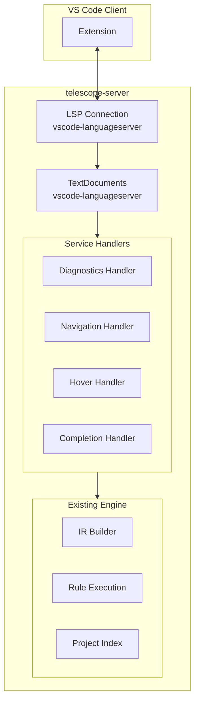
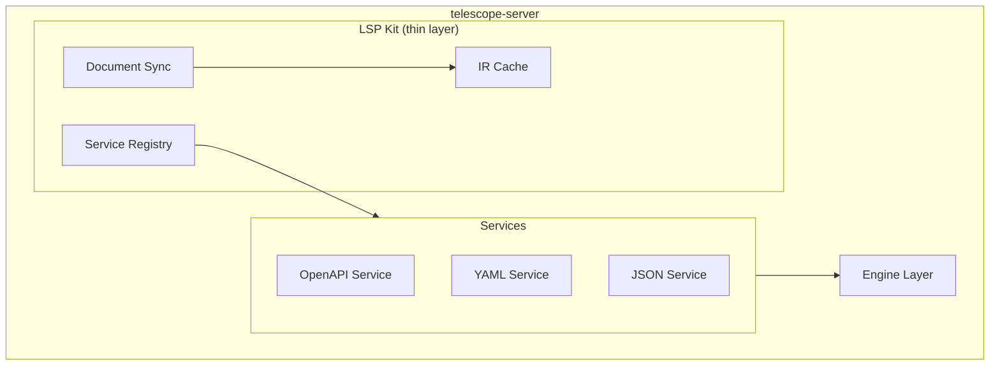
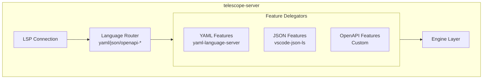

# Alternative LSP Architectures (Removing VolarJS)

## Current State Analysis

VolarJS currently provides:

- **Virtual Code System** - embedded markdown support in descriptions (complex)
- **Incremental document updates** - change range tracking (medium complexity)
- **Server infrastructure** - connection, project model, file watching (standard LSP)
- **Language service plugin pattern** - multi-service composition (adds indirection)
- **URI encoding/decoding** - for embedded document navigation (complex)

**38 files** import from `@volar/*` packages. The virtual code system alone is ~1,200 lines across 5 files.

---

## Option 1: Direct LSP with vscode-languageserver (Recommended)

**Complexity: Low | Feature Parity: ~90%**

Use `vscode-languageserver` directly without any abstraction framework. This is the "standard" approach used by most LSP servers.

### Architecture



### Key Changes

1. **Replace Volar connection with direct `vscode-languageserver`**
```typescript
// New server.ts (~50 lines vs current ~180)
import { createConnection, TextDocuments, ProposedFeatures } from 'vscode-languageserver/node';
import { TextDocument } from 'vscode-languageserver-textdocument';

const connection = createConnection(ProposedFeatures.all);
const documents = new TextDocuments(TextDocument);

// Direct handler registration
connection.onHover((params) => handleHover(params));
connection.onCompletion((params) => handleCompletion(params));
connection.onDefinition((params) => handleDefinition(params));

documents.onDidChangeContent((change) => {
  // Rebuild IR and run diagnostics
  validateDocument(change.document);
});

documents.listen(connection);
connection.listen();
```

2. **Simple document cache instead of VirtualCode**
```typescript
// document-cache.ts - single file, ~100 lines
interface CachedDocument {
  uri: string;
  content: string;
  ir: IRDocument;
  atoms: AtomIndex;
  version: number;
}

const cache = new Map<string, CachedDocument>();

function getOrBuildDocument(doc: TextDocument): CachedDocument {
  const cached = cache.get(doc.uri);
  if (cached?.version === doc.version) return cached;
  
  const content = doc.getText();
  const ir = buildIR(doc.uri, content);
  const atoms = extractAtoms(ir);
  
  const result = { uri: doc.uri, content, ir, atoms, version: doc.version };
  cache.set(doc.uri, result);
  return result;
}
```

3. **Drop embedded markdown language support** - The main complexity driver. Instead:

   - Render markdown hover previews as plain markdown (already works in hover)
   - Syntax highlighting for descriptions handled by client TextMate grammar
   - Code blocks in descriptions use the YAML/JSON string highlighting

### What We Keep

- All 15+ OpenAPI-specific LSP features (diagnostics, navigation, hover, etc.)
- Rule engine, IR, atoms, indexes - **unchanged**
- Workspace diagnostics with incremental updates
- $ref navigation and preview
- All validation rules

### What We Lose

- Markdown language features inside description fields (completions, diagnostics)
- Embedded code language support inside markdown code blocks
- Some edge-case position mapping for JSON escape sequences

### Files to Delete/Simplify

| Current | Action |

|---------|--------|

| `lsp/languages/*.ts` (5 files, ~1,200 lines) | Delete entirely |

| `lsp/services/yaml-service.ts` | Replace with direct yaml-language-server |

| `lsp/services/json-service.ts` | Replace with direct vscode-json-languageservice |

| `lsp/services/markdown-service.ts` | Delete |

| `lsp/workspace/context.ts` | Simplify to ~200 lines |

| `lsp/core/*.ts` | Merge into document-cache.ts |

**Estimated reduction: ~3,000 lines of code**

---

## Option 2: LSP Kit / Minimal Framework

**Complexity: Medium | Feature Parity: ~95%**

Build a thin abstraction layer (~300 lines) that provides only the features you actually need.

### Architecture



### Key Concept

Create a minimal "LSP Kit" that provides:

```typescript
// lsp-kit.ts (~300 lines total)
interface LspService {
  capabilities: ServerCapabilities;
  onHover?(params: HoverParams): Hover | null;
  onCompletion?(params: CompletionParams): CompletionItem[];
  onDefinition?(params: DefinitionParams): Location[];
  provideDiagnostics?(uri: string): Diagnostic[];
  // ... other LSP methods
}

class LspServer {
  private services: LspService[] = [];
  private cache: DocumentCache;
  
  register(service: LspService) {
    this.services.push(service);
  }
  
  // Aggregates capabilities and delegates to services
  start() {
    // Wire up connection handlers
    connection.onHover((params) => {
      for (const service of this.services) {
        const result = service.onHover?.(params);
        if (result) return result;
      }
      return null;
    });
  }
}
```

### Services

```typescript
// openapi-service.ts - all OpenAPI features in one file
export const openAPIService: LspService = {
  capabilities: {
    hoverProvider: true,
    definitionProvider: true,
    referencesProvider: true,
    // ...
  },
  
  onHover(params) {
    const doc = cache.get(params.textDocument.uri);
    if (!isOpenAPI(doc)) return null;
    return getRefPreview(doc, params.position);
  },
  
  onDefinition(params) {
    // Navigate $refs, operationIds, tags, etc.
  },
  
  provideDiagnostics(uri) {
    const doc = cache.get(uri);
    if (!isOpenAPI(doc)) return [];
    return runEngine(doc);
  }
};
```

### Markdown Support via String Extraction

Instead of virtual codes, extract markdown strings and process them separately:

```typescript
function getMarkdownRegions(doc: CachedDocument): MarkdownRegion[] {
  const regions: MarkdownRegion[] = [];
  // Walk IR and find description fields
  walkIR(doc.ir, (node) => {
    if (node.key === 'description' && node.kind === 'string') {
      regions.push({
        content: node.value as string,
        range: doc.sourceMap.locToRange(node.loc),
      });
    }
  });
  return regions;
}

// Use in hover to provide markdown preview
function onHover(params: HoverParams) {
  const region = findRegionAtPosition(params.position);
  if (region) {
    return { contents: { kind: 'markdown', value: region.content } };
  }
}
```

### What We Keep

- Everything from Option 1
- Cleaner service separation
- Easier to add new services

### What We Lose

- Same as Option 1 (embedded markdown editing)

**Estimated reduction: ~2,500 lines of code**

---

## Option 3: Hybrid - Keep yaml-language-server Integration

**Complexity: Medium-High | Feature Parity: ~98%**

Keep `yaml-language-server` and `vscode-json-languageservice` integration but remove Volar's virtual code abstraction.

### Architecture



### Key Approach

Route requests based on `languageId` to appropriate service:

```typescript
// router.ts
function routeRequest<T>(
  params: { textDocument: TextDocumentIdentifier },
  handlers: {
    yaml?: (doc: TextDocument) => T;
    json?: (doc: TextDocument) => T;
    openapi?: (doc: TextDocument) => T;
  }
): T | null {
  const doc = documents.get(params.textDocument.uri);
  if (!doc) return null;
  
  const langId = doc.languageId;
  
  if (langId === 'openapi-yaml' || langId === 'openapi-json') {
    // OpenAPI gets priority, falls through to yaml/json for basic features
    const result = handlers.openapi?.(doc);
    if (result) return result;
    // Fallthrough to format-specific
  }
  
  if (langId === 'yaml' || langId === 'openapi-yaml') {
    return handlers.yaml?.(doc) ?? null;
  }
  
  if (langId === 'json' || langId === 'openapi-json') {
    return handlers.json?.(doc) ?? null;
  }
  
  return null;
}

// Usage
connection.onHover((params) => routeRequest(params, {
  openapi: (doc) => getOpenAPIHover(doc, params.position),
  yaml: (doc) => yamlLanguageServer.doHover(doc, params.position),
  json: (doc) => jsonLanguageService.doHover(doc, params.position),
}));
```

### Simplified Schema Integration

```typescript
// schema-provider.ts - direct integration, no Volar indirection
const yamlLs = yaml.getLanguageService({
  schemaRequestService: async (uri) => {
    if (uri.startsWith('telescope://')) {
      const schemaKey = uri.slice('telescope://'.length);
      return JSON.stringify(getSchema(schemaKey));
    }
    return '';
  },
});

yamlLs.registerCustomSchemaProvider(async (docUri) => {
  const doc = documents.get(docUri);
  if (isOpenAPIRoot(doc)) return ['telescope://openapi-3.1-root'];
  if (isOpenAPISchema(doc)) return ['telescope://openapi-3.1-schema'];
  return [];
});
```

### What We Keep

- Full YAML/JSON language features (schema validation, completions, etc.)
- All OpenAPI features
- Better schema-based completions

### What We Lose

- Embedded markdown editing in descriptions
- Some virtual code complexity remains in position mapping

**Estimated reduction: ~1,800 lines of code**

---

## Comparison Matrix

| Aspect | Option 1 (Direct) | Option 2 (Kit) | Option 3 (Hybrid) |

|--------|-------------------|----------------|-------------------|

| **Lines removed** | ~3,000 | ~2,500 | ~1,800 |

| **Complexity** | Low | Medium | Medium-High |

| **Feature parity** | 90% | 95% | 98% |

| **Maintenance** | Easiest | Easy | Medium |

| **Embedded markdown** | No | No | No |

| **YAML schema completions** | Basic | Basic | Full |

| **Migration effort** | 2-3 days | 3-4 days | 4-5 days |

---

## Recommendation

**Option 1 (Direct LSP)** is recommended because:

1. **Simplest architecture** - Easy to understand, debug, and maintain
2. **Standard approach** - Follows patterns used by 90%+ of LSP servers
3. **Minimal dependencies** - Only vscode-languageserver + existing engine
4. **Embedded markdown rarely used** - Most users don't edit markdown inside YAML strings
5. **Core value preserved** - All OpenAPI validation, navigation, and intelligence features remain

The main "loss" is embedded markdown editing, which is a niche feature that adds significant complexity. Users can still:

- See markdown rendered in hovers
- Get syntax highlighting via TextMate grammars
- Edit descriptions as strings (just without markdown-specific completions)

---

## Next Steps (If Proceeding)

1. Create new `server.ts` with direct `vscode-languageserver` setup
2. Create `document-cache.ts` for IR/atoms caching
3. Port `openapi-service.ts` features to direct handlers
4. Remove all `lsp/languages/` virtual code files
5. Simplify `lsp/workspace/context.ts`
6. Update tests to use new architecture
7. Remove `@volar/*` dependencies from package.json