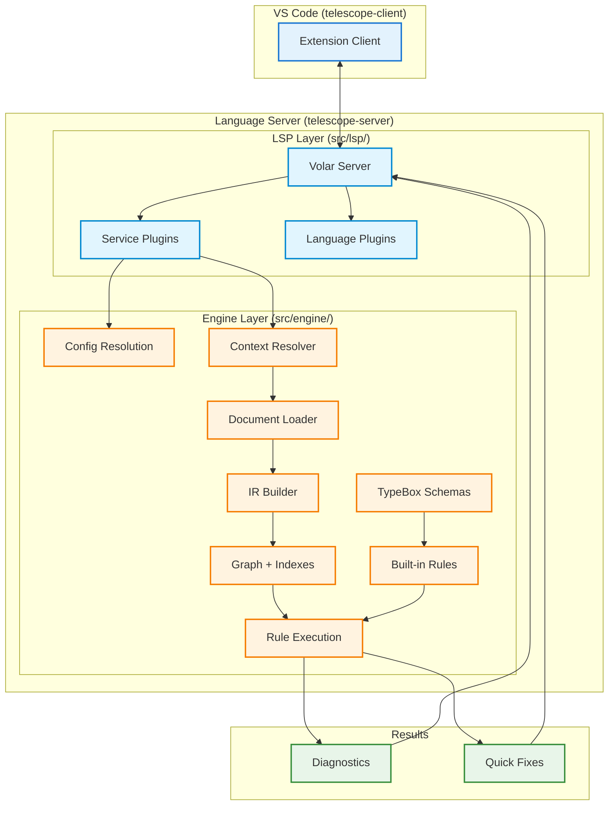
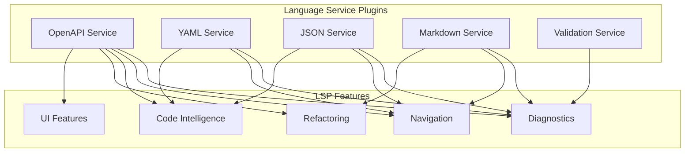

# Telescope Architecture

This document provides a detailed overview of Telescope's internal architecture for contributors and advanced users.

## Overview

Telescope is an OpenAPI linting tool built on the [Volar](https://volarjs.dev/) language server framework. It provides real-time diagnostics in VS Code through a unified pipeline that processes OpenAPI documents.

## Package Structure

```
telescope/
├── packages/
│   ├── telescope-client/        # VS Code extension client
│   │   └── src/
│   │       └── extension.ts    # Extension entry point
│   │
│   ├── telescope-server/        # Language server + linting engine
│   │   └── src/
│   │       ├── server.ts       # Main entry point
│   │       ├── lsp/            # Volar integration layer
│   │       │   ├── core/       # IR cache coordinator
│   │       │   ├── languages/  # Language plugins
│   │       │   ├── services/   # OpenAPI + validation services
│   │       │   └── workspace/  # Context + documents
│   │       └── engine/         # Core linting engine
│   │           ├── config/     # Configuration resolution
│   │           ├── context/    # Linting context management
│   │           ├── execution/  # Rule runners
│   │           ├── indexes/    # Graph building, project indexing
│   │           ├── ir/         # Intermediate representation
│   │           ├── rules/      # Rule API and built-in rules
│   │           ├── schemas/    # OpenAPI TypeBox schemas
│   │           └── utils/      # Utility functions
│   │
│   └── test-files/             # Test fixtures and examples
│       ├── openapi/            # OpenAPI test documents
│       ├── custom/             # Custom validation test files
│       └── .telescope/         # Example custom rules
```

## Data Flow



## Processing Pipeline

### Phase 1: Server Initialization

1. **Volar Server** starts with configured language and service plugins
2. **Language Plugins** register support for YAML and JSON documents
3. **Configuration** is loaded from `.telescope/config.yaml`

### Phase 2: Document Processing

4. **Document Loader** reads files through Volar's FileSystem API:

   - Parses YAML/JSON content
   - Builds IR (Intermediate Representation) with location tracking
   - Detects document type (root OpenAPI spec vs fragment)

5. **IR Builder** creates structured representation:
   - Preserves source locations for precise diagnostics
   - Handles both YAML and JSON formats
   - Supports incremental updates

### Phase 3: Indexing

6. **Indexes** process documents to build:
   - **GraphIndex**: Tracks `$ref` relationships between documents
   - **OperationIdIndex**: Monitors operation ID uniqueness
   - **AtomIndex**: Extracts operations, components, schemas
   - **ProjectIndex**: Provides reverse lookups

### Phase 4: Rule Execution

7. **Execution Layer** runs rules against indexed content:
   - **IR Runner**: Processes rules against IR documents
   - **Visitor Pattern**: Rules receive typed callbacks (Operation, Schema, etc.)
   - **TypeBox Schemas**: Provide type safety for rule authors

### Phase 5: Results

8. **Output Generation**:
   - **Diagnostics**: Violations with precise source locations
   - **Quick Fixes**: Optional code patches for auto-fixable issues
   - Results sent to VS Code via LSP protocol

## Key Components

### LSP Layer (`src/lsp/`)

| Component          | File                                        | Purpose                                     |
| ------------------ | ------------------------------------------- | ------------------------------------------- |
| Volar Server       | `server.ts`                                 | Main entry point, server initialization     |
| Core               | `core/core.ts`                              | IR cache coordinator, document lifecycle    |
| OpenAPI Service    | `services/openapi-service.ts`               | OpenAPI validation and rule execution       |
| Validation Service | `services/additional-validation-service.ts` | Config files, custom schemas, generic rules |
| Language Plugin    | `languages/universal-plugin.ts`             | YAML/JSON parsing                           |

### Engine Layer (`src/engine/`)

| Component     | Directory    | Purpose                                            |
| ------------- | ------------ | -------------------------------------------------- |
| Configuration | `config/`    | `.telescope/config.yaml` resolution                |
| Context       | `context/`   | Multi-root workspace handling, document caching    |
| Execution     | `execution/` | Rule runners (AST-based and IR-based)              |
| Indexes       | `indexes/`   | Graph building, atom extraction, project indexing  |
| IR            | `ir/`        | Intermediate representation with location tracking |
| Rules         | `rules/`     | Rule API, built-in rules (generic + SailPoint)     |
| Schemas       | `schemas/`   | TypeBox schemas for OpenAPI 3.0/3.1/3.2            |
| Utils         | `utils/`     | Pointer math, logging, file system utilities       |

## Document Types

Telescope classifies documents into three types:

| Type         | Description                                         | Example         |
| ------------ | --------------------------------------------------- | --------------- |
| **Root**     | Complete OpenAPI specification with `openapi` field | Main API spec   |
| **Fragment** | Partial document referenced via `$ref`              | Component files |
| **Unknown**  | Non-OpenAPI YAML/JSON files                         | Config files    |

## Multi-File Support

Telescope supports complex API projects split across multiple files:

```yaml
# api.yaml (root)
openapi: 3.0.0
paths:
  /users:
    $ref: "./paths/users.yaml"
components:
  schemas:
    User:
      $ref: "./schemas/User.yaml"
```

The **GraphIndex** tracks all `$ref` relationships and enables:

- Cross-file validation
- Cycle detection
- Reference resolution

## Configuration Resolution

Configuration is loaded from `.telescope/config.yaml` with these precedence rules:

1. Explicit file patterns override defaults
2. Rule overrides merge with built-in defaults
3. Custom rules are loaded via Bun's TypeScript loader

## Service Architecture

Telescope implements a multi-service architecture where each service provides specific LSP capabilities:



### OpenAPI Service (`openapi-service.ts`)

The primary service for OpenAPI documents, providing 15 LSP features:

| Feature                   | Implementation                             |
| ------------------------- | ------------------------------------------ |
| **Diagnostics**           | Runs rule engine against documents         |
| **Workspace Diagnostics** | Validates all OpenAPI files with caching   |
| **Document Links**        | Clickable `$ref` with position resolution  |
| **Hover**                 | Preview referenced content inline          |
| **Code Actions**          | Quick fixes for common issues              |
| **References**            | Find all usages of components/operationIds |
| **Workspace Symbols**     | Search across all OpenAPI files            |
| **Completions**           | `$ref`, status codes, media types, tags    |
| **Rename**                | Rename operationIds and components         |
| **Code Lens**             | Reference counts, response summaries       |
| **Inlay Hints**           | Type hints, required markers               |
| **Definition**            | Enhanced navigation for OpenAPI refs       |
| **Call Hierarchy**        | Component reference relationships          |
| **Semantic Tokens**       | Enhanced syntax highlighting               |

The service uses `OpenAPIVirtualCode` instances which provide:

- Parsed IR (Intermediate Representation)
- Atoms (operations, components, schemas)
- Location mapping for precise positioning

### YAML Service (`yaml-service.ts`)

Wraps `yaml-language-server` for generic YAML support:

- Code actions, code lens with resolution
- Completions with schema awareness
- Definition navigation
- Diagnostics (TypeBox + JSON Schema)
- Document symbols, hover, document links
- Folding ranges, selection ranges
- On-type formatting

Schema validation uses a priority system:

1. **TypeBox schemas** (if available) - Better error messages
2. **JSON Schema** - Standard validation fallback

### JSON Service (`json-service.ts`)

Wraps `vscode-json-languageservice` for generic JSON support:

- Completions with resolve support
- Definition navigation
- Diagnostics (TypeBox + JSON Schema)
- Hover, document links
- Document symbols, colors
- Folding ranges, selection ranges
- Document formatting

### Markdown Service (`markdown-service.ts`)

Provides full markdown support for `description` and `summary` fields:

- Code actions with resolve (organize link definitions)
- Completions for links and paths
- Definition, references, rename
- Diagnostics (link validation)
- Document highlights, document links
- Document symbols, folding ranges
- Hover, selection ranges
- Workspace symbols, file references
- File rename edits

Handles JSON string encoding for markdown embedded in JSON files.

### Validation Service (`validation-service.ts`)

Handles custom file validation using generic rules:

- Runs rules from `additionalValidation` config
- Caches diagnostics with content hashing
- Supports workspace-wide validation

## LSP Feature Implementation Details

### Virtual Codes

Telescope uses Volar's Virtual Code system to provide embedded language support:

```
OpenAPI Document (openapi-yaml/openapi-json)
├── DataVirtualCode (yaml/json) - Format-specific features
├── MarkdownVirtualCode (markdown) - Description fields
└── OpenAPIVirtualCode - OpenAPI-specific features
```

Each Virtual Code type:

- `DataVirtualCode`: Parses YAML/JSON, provides AST, schema key
- `MarkdownVirtualCode`: Extracts markdown from descriptions with JSON string mapping
- `OpenAPIVirtualCode`: Extends DataVirtualCode with IR, atoms, location mapping

### Semantic Tokens

The OpenAPI service provides semantic highlighting for:

| Token Type      | Elements                     |
| --------------- | ---------------------------- |
| `namespace`     | Path strings (`/users/{id}`) |
| `type`          | Schema definitions           |
| `enum`          | HTTP status codes            |
| `variable`      | `$ref` values                |
| `function`      | operationId values           |
| `method`        | HTTP methods                 |
| `macro`         | Security scheme names        |
| `keyword`       | Schema types                 |
| `modifier`      | Deprecated flags             |
| `typeParameter` | Path parameters              |
| `string`        | Media types                  |

### Code Actions

Quick fixes are generated based on diagnostic codes:

```typescript
// Diagnostic code contains "description"
→ Add description: "TODO: Add description"

// Diagnostic code contains "operationId"
→ Add operationId: "getUsers" (auto-generated)

// Diagnostic code contains "kebab"
→ Convert to kebab-case
```

### Call Hierarchy

Uses the `GraphIndex` to traverse component relationships:

- **Incoming calls**: `graphIndex.dependentsOf(node)` - what references this
- **Outgoing calls**: `graphIndex.referencesFrom(node)` - what this references

### Workspace Index

The `WorkspaceIndex` coordinates cross-document features:

- Tracks `$ref` relationships via `GraphIndex`
- Monitors operationId uniqueness via `OpIdIndex`
- Manages affected files for incremental updates
- Provides result ID caching for workspace diagnostics

## Extension Points

### Custom Rules

Rules are defined using `defineRule()` or `defineGenericRule()`:

```typescript
import { defineRule } from "telescope-server";

export default defineRule({
  meta: { id: "my-rule", ... },
  check(ctx) {
    return {
      Operation(op) { /* validate operation */ },
      Schema(schema) { /* validate schema */ },
    };
  },
});
```

### Custom Schemas

TypeBox schemas for file validation:

```typescript
import { defineSchema } from "telescope-server";

export default defineSchema((Type) =>
  Type.Object({
    name: Type.String(),
    version: Type.String(),
  })
);
```

## Performance Considerations

- **Incremental Updates**: Only changed documents are reprocessed
- **IR Caching**: Parsed documents are cached between edits
- **Index Reuse**: Indexes are updated incrementally when possible
- **Lazy Loading**: Custom rules are loaded on-demand

## Related Documentation

- [README](README.md) - Project overview and quick start
- [LSP Features](docs/LSP-FEATURES.md) - Complete LSP feature reference
- [Configuration](docs/CONFIGURATION.md) - Full configuration reference
- [Custom Rules](docs/CUSTOM-RULES.md) - Rule authoring guide
- [Built-in Rules](packages/telescope-server/src/engine/rules/RULES.md) - Rule reference
