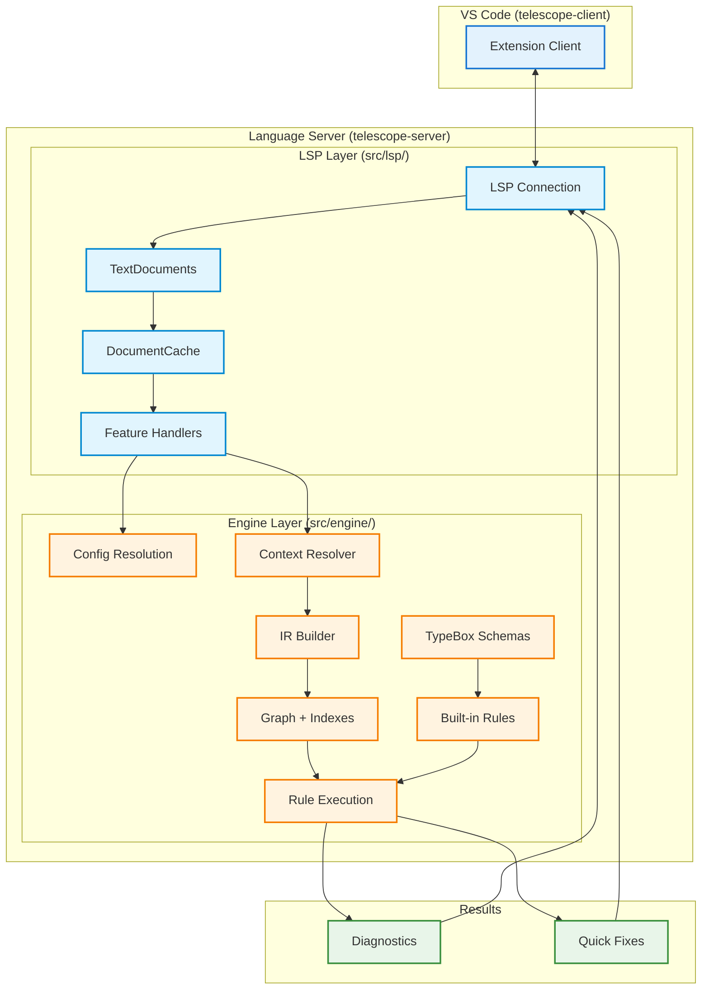

# Telescope Architecture

This document provides a detailed overview of Telescope's internal architecture for contributors and advanced users.

## Overview

Telescope is an OpenAPI linting tool built on the Language Server Protocol (LSP) using `vscode-languageserver`. It provides real-time diagnostics in VS Code through a unified pipeline that processes OpenAPI documents.

## Package Structure

```
telescope/
├── packages/
│   ├── telescope-client/        # VS Code extension client
│   │   └── src/
│   │       └── extension.ts    # Extension entry point
│   │
│   ├── telescope-server/        # Language server + linting engine
│   │   └── src/
│   │       ├── server.ts       # Main entry point
│   │       ├── lsp/            # LSP integration layer
│   │       │   ├── context.ts      # Shared context
│   │       │   ├── document-cache.ts  # Document caching
│   │       │   └── handlers/       # LSP feature handlers
│   │       │       ├── diagnostics.ts
│   │       │       ├── navigation.ts
│   │       │       ├── hover.ts
│   │       │       ├── completions.ts
│   │       │       ├── code-actions.ts
│   │       │       ├── code-lens.ts
│   │       │       ├── inlay-hints.ts
│   │       │       ├── rename.ts
│   │       │       ├── symbols.ts
│   │       │       ├── semantic-tokens.ts
│   │       │       └── document-links.ts
│   │       └── engine/         # Core linting engine
│   │           ├── config/     # Configuration resolution
│   │           ├── context/    # Linting context management
│   │           ├── execution/  # Rule runners
│   │           ├── indexes/    # Graph building, project indexing
│   │           ├── ir/         # Intermediate representation
│   │           ├── rules/      # Rule API and built-in rules
│   │           ├── schemas/    # OpenAPI TypeBox schemas
│   │           └── utils/      # Utility functions
│   │
│   └── test-files/             # Test fixtures and examples
│       ├── openapi/            # OpenAPI test documents
│       ├── custom/             # Custom validation test files
│       └── .telescope/         # Example custom rules
```

## Data Flow



## Processing Pipeline

### Phase 1: Server Initialization

1. **LSP Connection** starts with `vscode-languageserver`
2. **Feature Handlers** are registered for all LSP capabilities
3. **Configuration** is loaded from `.telescope/config.yaml`

### Phase 2: Document Processing

4. **DocumentCache** manages parsed documents:

   - Parses YAML/JSON content
   - Builds IR (Intermediate Representation) with location tracking
   - Detects document type (root OpenAPI spec vs fragment)
   - Caches parsed data for performance

5. **IR Builder** creates structured representation:
   - Preserves source locations for precise diagnostics
   - Handles both YAML and JSON formats
   - Supports incremental updates via cache invalidation

### Phase 3: Indexing

6. **Indexes** process documents to build:
   - **GraphIndex**: Tracks `$ref` relationships between documents
   - **OperationIdIndex**: Monitors operation ID uniqueness
   - **AtomIndex**: Extracts operations, components, schemas
   - **ProjectIndex**: Provides reverse lookups

### Phase 4: Rule Execution

7. **Execution Layer** runs rules against indexed content:
   - **IR Runner**: Processes rules against IR documents
   - **Visitor Pattern**: Rules receive typed callbacks (Operation, Schema, etc.)
   - **TypeBox Schemas**: Provide type safety for rule authors

### Phase 5: Results

8. **Output Generation**:
   - **Diagnostics**: Violations with precise source locations
   - **Quick Fixes**: Optional code patches for auto-fixable issues
   - Results sent to VS Code via LSP protocol

## Key Components

### LSP Layer (`src/lsp/`)

| Component      | File                           | Purpose                         |
| -------------- | ------------------------------ | ------------------------------- |
| Server Entry   | `server.ts`                    | Main entry point, initialization |
| Context        | `context.ts`                   | Shared workspace state, rules   |
| Document Cache | `document-cache.ts`            | IR/atoms caching, position utils |
| Diagnostics    | `handlers/diagnostics.ts`      | Pull-based and workspace diags  |
| Navigation     | `handlers/navigation.ts`       | Definition, references, call hierarchy |
| Hover          | `handlers/hover.ts`            | $ref previews                   |
| Completions    | `handlers/completions.ts`      | OpenAPI-specific completions    |
| Code Actions   | `handlers/code-actions.ts`     | Quick fixes                     |
| Symbols        | `handlers/symbols.ts`          | Document/workspace symbols      |
| Semantic Tokens| `handlers/semantic-tokens.ts`  | Enhanced syntax highlighting    |

### Engine Layer (`src/engine/`)

| Component     | Directory    | Purpose                                            |
| ------------- | ------------ | -------------------------------------------------- |
| Configuration | `config/`    | `.telescope/config.yaml` resolution                |
| Context       | `context/`   | Multi-root workspace handling, document caching    |
| Execution     | `execution/` | Rule runners (AST-based and IR-based)              |
| Indexes       | `indexes/`   | Graph building, atom extraction, project indexing  |
| IR            | `ir/`        | Intermediate representation with location tracking |
| Rules         | `rules/`     | Rule API, built-in rules (generic + SailPoint)     |
| Schemas       | `schemas/`   | TypeBox schemas for OpenAPI 3.0/3.1/3.2            |
| Utils         | `utils/`     | Pointer math, logging, file system utilities       |

## Document Types

Telescope classifies documents into three types:

| Type         | Description                                         | Example         |
| ------------ | --------------------------------------------------- | --------------- |
| **Root**     | Complete OpenAPI specification with `openapi` field | Main API spec   |
| **Fragment** | Partial document referenced via `$ref`              | Component files |
| **Unknown**  | Non-OpenAPI YAML/JSON files                         | Config files    |

## Multi-File Support

Telescope supports complex API projects split across multiple files:

```yaml
# api.yaml (root)
openapi: 3.0.0
paths:
  /users:
    $ref: "./paths/users.yaml"
components:
  schemas:
    User:
      $ref: "./schemas/User.yaml"
```

The **GraphIndex** tracks all `$ref` relationships and enables:

- Cross-file validation
- Cycle detection
- Reference resolution

## Configuration Resolution

Configuration is loaded from `.telescope/config.yaml` with these precedence rules:

1. Explicit file patterns override defaults
2. Rule overrides merge with built-in defaults
3. Custom rules are loaded via Bun's TypeScript loader

## LSP Feature Implementation

### Handler Architecture

Telescope implements a modular handler architecture where each handler provides specific LSP capabilities:

```mermaid
flowchart TB
    subgraph Handlers["LSP Feature Handlers"]
        Diag["Diagnostics Handler"]
        Nav["Navigation Handler"]
        Hover["Hover Handler"]
        Comp["Completions Handler"]
        Actions["Code Actions Handler"]
        Lens["Code Lens Handler"]
        Hints["Inlay Hints Handler"]
        Rename["Rename Handler"]
        Symbols["Symbols Handler"]
        Semantic["Semantic Tokens Handler"]
        Links["Document Links Handler"]
    end

    subgraph Features["LSP Capabilities"]
        PullDiag["Pull Diagnostics"]
        WorkspaceDiag["Workspace Diagnostics"]
        Definition["Go to Definition"]
        References["Find References"]
        CallHier["Call Hierarchy"]
        HoverInfo["Hover Preview"]
        RefComp["$ref Completions"]
        QuickFix["Quick Fixes"]
        RefCount["Reference Counts"]
        TypeHints["Type Hints"]
        SymbolRename["Symbol Rename"]
        DocSymbols["Document Symbols"]
        Highlighting["Syntax Highlighting"]
        ClickableRefs["Clickable $refs"]
    end

    Diag --> PullDiag
    Diag --> WorkspaceDiag
    Nav --> Definition
    Nav --> References
    Nav --> CallHier
    Hover --> HoverInfo
    Comp --> RefComp
    Actions --> QuickFix
    Lens --> RefCount
    Hints --> TypeHints
    Rename --> SymbolRename
    Symbols --> DocSymbols
    Semantic --> Highlighting
    Links --> ClickableRefs
```



### Feature Summary

| Feature                   | Handler                    | Implementation                           |
| ------------------------- | -------------------------- | ---------------------------------------- |
| **Diagnostics**           | `diagnostics.ts`           | Runs rule engine against documents       |
| **Workspace Diagnostics** | `diagnostics.ts`           | Validates all OpenAPI files with caching |
| **Document Links**        | `document-links.ts`        | Clickable `$ref` with position resolution|
| **Hover**                 | `hover.ts`                 | Preview referenced content inline        |
| **Code Actions**          | `code-actions.ts`          | Quick fixes for common issues            |
| **References**            | `navigation.ts`            | Find all usages of components            |
| **Workspace Symbols**     | `symbols.ts`               | Search across all OpenAPI files          |
| **Completions**           | `completions.ts`           | `$ref`, status codes, media types, tags  |
| **Rename**                | `rename.ts`                | Rename operationIds and components       |
| **Code Lens**             | `code-lens.ts`             | Reference counts, response summaries     |
| **Inlay Hints**           | `inlay-hints.ts`           | Type hints, required markers             |
| **Definition**            | `navigation.ts`            | Enhanced navigation for OpenAPI refs     |
| **Call Hierarchy**        | `navigation.ts`            | Component reference relationships        |
| **Semantic Tokens**       | `semantic-tokens.ts`       | Enhanced syntax highlighting             |

### DocumentCache

The `DocumentCache` manages parsed document data:

```typescript
interface CachedDocument {
  uri: string;
  version: number;
  format: "yaml" | "json";
  content: string;
  hash: string;
  ast: yaml.Document | jsonc.Node;
  parsedObject: unknown;
  ir: IRDocument;
  atoms: AtomIndex;
  documentType: DocumentType;
  openapiVersion: string;
  lineOffsets: number[];
}
```

Key features:
- **Version tracking**: Cache invalidated on document changes
- **IR building**: Automatic IR and atoms extraction
- **Position utilities**: `locToRange`, `positionToOffset`, `getRange`

### Semantic Tokens

The semantic tokens handler provides highlighting for:

| Token Type      | Elements                     |
| --------------- | ---------------------------- |
| `namespace`     | Path strings (`/users/{id}`) |
| `type`          | Schema definitions           |
| `enum`          | HTTP status codes            |
| `variable`      | `$ref` values                |
| `function`      | operationId values           |
| `method`        | HTTP methods                 |
| `macro`         | Security scheme names        |
| `keyword`       | Schema types                 |
| `modifier`      | Deprecated flags             |
| `typeParameter` | Path parameters              |
| `string`        | Media types                  |

### Code Actions

Quick fixes are generated based on diagnostic codes:

```typescript
// Diagnostic code contains "description"
→ Add description: "TODO: Add description"

// Diagnostic code contains "operationId"
→ Add operationId: "getUsers" (auto-generated)

// Diagnostic code contains "kebab"
→ Convert to kebab-case
```

### Call Hierarchy

Uses the IR graph to traverse component relationships:

- **Incoming calls**: What references this component
- **Outgoing calls**: What this component references

## Extension Points

### Custom Rules

Rules are defined using `defineRule()` or `defineGenericRule()`:

```typescript
import { defineRule } from "telescope-server";

export default defineRule({
  meta: { id: "my-rule", ... },
  check(ctx) {
    return {
      Operation(op) { /* validate operation */ },
      Schema(schema) { /* validate schema */ },
    };
  },
});
```

### Custom Schemas

TypeBox schemas for file validation:

```typescript
import { defineSchema } from "telescope-server";

export default defineSchema((Type) =>
  Type.Object({
    name: Type.String(),
    version: Type.String(),
  })
);
```

## Performance Considerations

- **Incremental Updates**: Only changed documents are reprocessed
- **Document Caching**: Parsed documents are cached between edits
- **Index Reuse**: Indexes are updated incrementally when possible
- **Lazy Loading**: Custom rules are loaded on-demand

## Related Documentation

- [README](README.md) - Project overview and quick start
- [LSP Features](docs/LSP-FEATURES.md) - Complete LSP feature reference
- [Configuration](docs/CONFIGURATION.md) - Full configuration reference
- [Custom Rules](docs/CUSTOM-RULES.md) - Rule authoring guide
- [Built-in Rules](packages/telescope-server/src/engine/rules/RULES.md) - Rule reference
