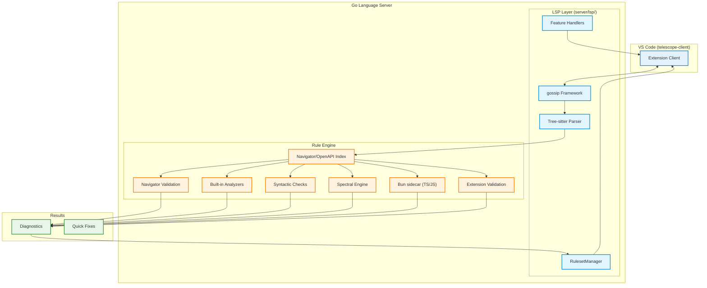

# Telescope Architecture

This document provides a detailed overview of Telescope's internal architecture for contributors and advanced users.

## Overview

Telescope is an OpenAPI linting tool built as a **Go language server** on the [gossip](https://github.com/LukasParke/gossip) LSP framework with native tree-sitter integration. A **VS Code extension** (TypeScript) acts as the client, discovering OpenAPI files and managing LSP sessions. Navigator now owns canonical OpenAPI parsing and validation, Barrelman owns shared built-in lint logic, and Telescope owns the editor-facing LSP/client/plugin experience.

## Repository Structure

```
telescope/
├── server/                    # Go language server + CLI (primary)
│   ├── cli/                   # Cobra CLI (lint, ci, serve)
│   ├── config/                # .telescope.yaml loading
│   ├── extensions/            # x-* extension validation
│   ├── lsp/                   # LSP server + 20+ feature handlers
│   ├── markdown/              # Markdown parsing (goldmark)
│   ├── openapi/               # Compatibility model + adapters over Navigator data
│   ├── plugin/                # In-process plugin helpers; YAML rule adapters
│   ├── project/               # Multi-file workspace + $ref resolution
│   ├── rules/                 # Rule registry, builder, walker
│   │   ├── analyzers/         # Built-in analyzers (structural, naming, etc.)
│   │   ├── checks/            # Syntactic checks (duplicate keys, ASCII)
│   │   └── testing/           # Test harness for rules
│   ├── rulesets/              # Ruleset loading/merging (Spectral compat)
│   ├── sdk/                   # Public Go API (Workspace, programmatic lint)
│   ├── spectral/              # Spectral rule engine (JSONPath + functions)
│   ├── testutil/              # Test utilities and fixture specs
│   └── validation/            # Non-OpenAPI file validation (`additionalValidation`)
│
├── client/                    # VS Code extension client
│   └── src/
│       ├── extension.ts       # Extension entry point
│       ├── session-manager.ts # Multi-root workspace orchestration
│       ├── session.ts         # Single LSP session lifecycle
│       ├── classifier.ts      # OpenAPI document classification
│       └── workspace-scanner.ts  # File discovery
│
├── test-files/                # Test fixtures and examples
```

## Data Flow (Go Server)


```mermaid
flowchart TB
    subgraph Client["VS Code (telescope-client)"]
        Extension[Extension Client]
    end

    subgraph Server["Go Language Server"]
        subgraph LSP["LSP Layer (server/lsp/)"]
            Gossip["gossip Framework"]
            TreeSitter["Tree-sitter Parser"]
            Handlers["Feature Handlers"]
            RulesetMgr["RulesetManager"]
        end

        subgraph Engine["Rule Engine"]
            Index["Navigator/OpenAPI Index"]
            Navigator["Navigator Validation"]
            Analyzers["Built-in Analyzers"]
            Checks["Syntactic Checks"]
            Spectral["Spectral Engine"]
            BunSidecar["Bun sidecar (TS/JS)"]
            ExtVal["Extension Validation"]
        end
    end

    subgraph Output["Results"]
        Diagnostics["Diagnostics"]
        Fixes["Quick Fixes"]
    end

    Extension <--> Gossip
    Gossip --> TreeSitter
    TreeSitter --> Index
    Index --> Navigator
    Index --> Analyzers
    Index --> Checks
    Index --> Spectral
    Index --> BunSidecar
    Index --> ExtVal

    Navigator --> Diagnostics
    Analyzers --> Diagnostics
    Checks --> Diagnostics
    Spectral --> Diagnostics
    BunSidecar --> Diagnostics
    ExtVal --> Diagnostics

    Diagnostics --> RulesetMgr
    RulesetMgr --> Extension
    Handlers --> Extension

    classDef client fill:#e3f2fd,stroke:#1976d2,stroke-width:2px
    classDef lsp fill:#e1f5fe,stroke:#0288d1,stroke-width:2px
    classDef engine fill:#fff3e0,stroke:#f57c00,stroke-width:2px
    classDef output fill:#e8f5e9,stroke:#388e3c,stroke-width:2px

    class Extension client
    class Gossip,TreeSitter,Handlers,RulesetMgr lsp
    class Index,Navigator,Analyzers,Checks,Spectral,BunSidecar,ExtVal engine
    class Diagnostics,Fixes output
```

## Processing Pipeline

### Phase 1: Server Initialization

1. **gossip server** starts with tree-sitter language support for YAML and JSON
2. **Feature handlers** are registered for all LSP capabilities (20+ handlers)
3. **Configuration** is loaded from `.telescope.yaml`
4. **RulesetManager** merges config, built-in rulesets, and Spectral rulesets
5. **Bun sidecar** may start when custom TS/JS rules or Spectral paths require it

### Phase 2: Document Processing

6. **Tree-sitter** incrementally parses YAML/JSON documents
7. **Navigator + OpenAPI index** construct the canonical document model and Telescope compatibility surface:
   - `Document`, `Operation`, `Schema`, `Parameter`, `Response`, etc.
   - All constructs track source locations via `openapi.Loc`
   - Index is cached per-document via `openapi.IndexCache`

### Phase 3: Rule Execution

8. The **DiagnosticEngine** runs multiple analyzer types:
   - **Navigator validation** -- Canonical syntax, structural, schema-shape, and meta-schema diagnostics
   - **Barrelman/Telescope analyzers** -- Built-in rules using visitor pattern against the OpenAPI index
   - **Telescope checks** -- Tree-sitter pattern-based syntactic checks
   - **Spectral engine** -- JSONPath + built-in functions for declarative YAML rules
   - **Bun sidecar** -- TypeScript/JavaScript custom rules (optional)
   - **Extension validation** -- `x-*` property schema validation
   - **Additional validation** -- Non-OpenAPI files matched by `additionalValidation`

### Phase 4: Results

9. **RulesetManager** filters diagnostics by configured severity overrides
10. **Diagnostics** with precise source locations are sent to the client

## Key Components

### Go Server (`server/`)

| Component | Directory | Purpose |
| --------- | --------- | ------- |
| CLI | `cli/` | `lint`, `ci`, `serve` subcommands via Cobra |
| Config | `config/` | `.telescope.yaml` resolution, Spectral config compat |
| Extensions | `extensions/` | `x-*` extension schema registry and validation |
| LSP Server | `lsp/server.go` | gossip wiring, analyzer registration, file watchers |
| Feature Handlers | `lsp/*.go` | Hover, completion, definition, references, rename, code actions, code lens, semantic tokens, etc. |
| RulesetManager | `lsp/ruleset_manager.go` | Config merging, severity filtering, hot-reload |
| ChildLSPManager | `lsp/childlsp.go` | Spawns child YAML/JSON LSPs for syntax validation |
| OpenAPI Parser | `openapi/parser.go` | Compatibility parsing helpers over Navigator-backed content |
| OpenAPI Index | `openapi/index.go` | Fast lookups by operation ID, path, component |
| Index Cache | `openapi/index.go` | Thread-safe per-document caching (`sync.RWMutex`) |
| Rule Builder | `rules/builder.go` | Fluent API: `Define().Operations().Schemas()...` |
| Reporter | `rules/reporter.go` | Diagnostic reporting with chainable enrichment |
| Walker | `rules/walker.go` | OpenAPI model traversal for rule execution |
| Validators | `rules/validators.go` | Composable field validators (`Required`, `KebabCase`, etc.) |
| Analyzers | `rules/analyzers/` | Naming, docs, security, and other built-in rule coverage |
| Checks | `rules/checks/` | Duplicate keys, ASCII validation |
| Test Harness | `rules/testing/` | `rulestest.Run()` with exact diagnostic assertions |
| Rulesets | `rulesets/` | Loading, merging, resolution, Spectral OAS built-in |
| Spectral Engine | `spectral/` | JSONPath evaluation + built-in functions |
| Plugin helpers | `plugin/` | In-process `Plugin` interface; YAML adapters |
| Go SDK | `sdk/` | Workspace API, programmatic lint, type re-exports |
| Project Manager | `project/` | Workspace scanning, dependency graph, $ref resolution |
| Markdown | `markdown/` | Markdown parsing in description fields |
| Validation | `validation/` | Non-OpenAPI file validation matched by `additionalValidation` |

### VS Code Client (`client/`)

| Component | File | Purpose |
| --------- | ---- | ------- |
| Extension Entry | `extension.ts` | Activation, command registration, Go binary resolution |
| Session Manager | `session-manager.ts` | One `Session` per workspace folder |
| Session | `session.ts` | Single LSP session lifecycle |
| Classifier | `classifier.ts` | OpenAPI document type detection |
| Scanner | `workspace-scanner.ts` | Workspace file discovery |

## Document Types

Telescope classifies documents into three types:

| Type | Description | Example |
| ---- | ----------- | ------- |
| **Root** | Complete OpenAPI specification with `openapi` field | Main API spec |
| **Fragment** | Partial document referenced via `$ref` | Component files |
| **Unknown** | Non-OpenAPI YAML/JSON files | Config files |

## Multi-File Support

Telescope supports complex API projects split across multiple files:

```yaml
# api.yaml (root)
openapi: 3.0.0
paths:
  /users:
    $ref: "./paths/users.yaml"
components:
  schemas:
    User:
      $ref: "./schemas/User.yaml"
```

The **ProjectManager** builds a dependency graph and provides:

- Cross-file `$ref` resolution
- Cycle detection
- Project-level diagnostics
- Workspace-wide validation and lint coordination

## Configuration Resolution

Configuration is loaded from `.telescope.yaml` with these precedence rules:

1. `extends` specifies a base ruleset (`telescope:recommended`, etc.)
2. Spectral YAML rulesets from `spectralRulesets` are merged
3. `rules` section overrides individual rule severities
4. Final enabled rules + severities are computed by `RulesetManager`

## Custom Rules

End-user custom rules use **YAML** (`.telescope.yaml`, `openapi.rules`, `spectralRulesets`) and optional **Bun**-hosted TypeScript/JavaScript. Spectral-compatible YAML rulesets provide declarative JSONPath rules without executing user JavaScript in-process.

Contributors can add built-in Go rules in `rules/analyzers` using `rules.Define()` (see [CUSTOM-RULES.md](docs/CUSTOM-RULES.md)).

## LSP Feature Handlers

| Feature | Handler | Implementation |
| ------- | ------- | -------------- |
| **Diagnostics** | `diagnostics.go` | Runs rule engine against documents |
| **Document Links** | `document_links.go` | Clickable `$ref` with position resolution |
| **Hover** | `hover.go` | Preview referenced content inline |
| **Code Actions** | `code_actions.go` | Quick fixes for common issues |
| **References** | `references.go` | Find all usages of components |
| **Workspace Symbols** | `symbols.go` | Search across all OpenAPI files |
| **Completions** | `completion.go` | `$ref`, status codes, media types, tags |
| **Rename** | `rename.go` | Rename operationIds and components |
| **Code Lens** | `code_lens.go` | Reference counts, response summaries |
| **Inlay Hints** | `inlay_hints.go` | Type hints, required markers |
| **Definition** | `definition.go` | Navigate to `$ref` targets |
| **Call Hierarchy** | `call_hierarchy.go` | Component reference relationships |
| **Semantic Tokens** | `semantic_tokens.go` | Enhanced syntax highlighting |

## Performance Considerations

- **Tree-sitter incremental parsing**: Only changed portions of documents are re-parsed
- **Index caching**: OpenAPI indexes are cached per-document, invalidated on changes
- **Debounced diagnostics**: LSP diagnostics are debounced (configurable, default 300ms)

## Key Dependencies

| Package | Purpose |
| ------- | ------- |
| [gossip](https://github.com/LukasParke/gossip) | LSP framework with tree-sitter integration |
| [go-tree-sitter](https://github.com/tree-sitter/go-tree-sitter) | Incremental YAML/JSON parsing |
| [yuin/goldmark](https://github.com/yuin/goldmark) | Markdown parsing and validation |
| [vmware-labs/yaml-jsonpath](https://github.com/vmware-labs/yaml-jsonpath) | JSONPath for Spectral rules |
| [spf13/cobra](https://github.com/spf13/cobra) | CLI framework |

## Related Documentation

- [README](README.md) - Project overview and quick start
- [Server README](server/README.md) - Go server details and SDK reference
- [LSP Features](docs/LSP-FEATURES.md) - Complete LSP feature reference
- [Configuration](docs/CONFIGURATION.md) - Full configuration reference
- [Custom Rules](docs/CUSTOM-RULES.md) - Rule authoring guide
- [Contributing](CONTRIBUTING.md) - Development guidelines
