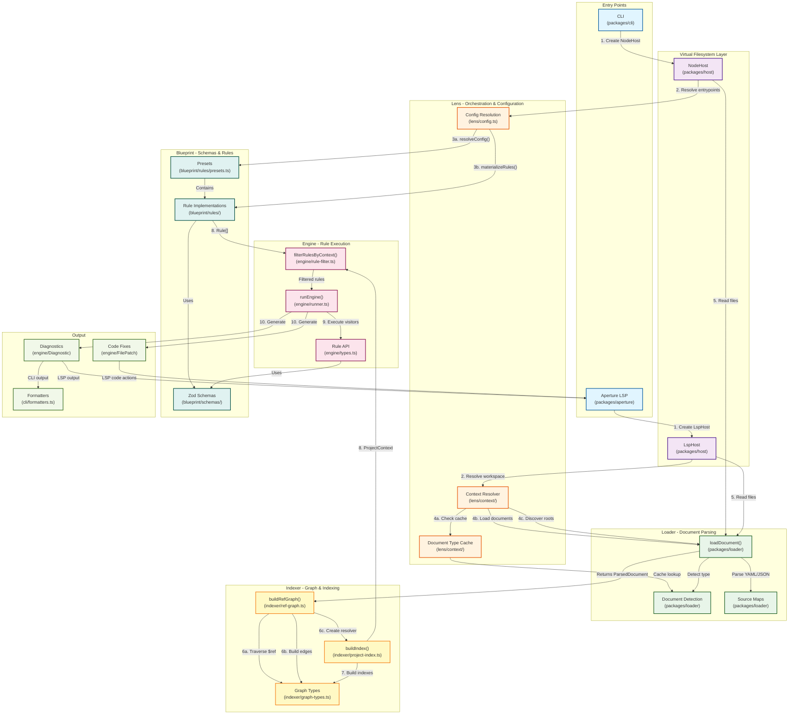

# Telescope Architecture Flow

This document outlines the exact flow of how all packages work together in Telescope.

## Package Interaction Flow



## Detailed Flow Description

### Phase 1: Entry & Host Setup

1. **CLI** or **Aperture LSP** receives input (file paths or document URIs)
2. Creates appropriate **Host** implementation:
   - CLI → `NodeHost` (filesystem access)
   - Aperture → `LspHost` (VS Code TextDocuments)

### Phase 2: Configuration & Context Resolution

3. **Lens** orchestrates the process:
   - **Config Resolution**: Reads configuration, resolves presets from `blueprint`, materializes rules
   - **Context Resolution**: Determines linting mode (project-aware, fragment, multi-root)
   - Uses **Document Type Cache** to avoid redundant type detection

### Phase 3: Document Loading

4. **Loader** reads files through the **Host**:
   - Parses YAML/JSON into AST
   - Builds source maps for position tracking
   - Detects document type (root, fragment, unknown)
   - Returns `ParsedDocument` objects

### Phase 4: Graph & Index Building

5. **Indexer** processes documents:
   - **buildRefGraph()**: Traverses AST, finds all `$ref` references, builds dependency graph
   - Creates **Resolver** for dereferencing `$ref` values
   - **buildIndex()**: Builds reverse lookups (paths → operations, components → references, etc.)
   - Returns `ProjectContext` with docs, graph, index, and resolver

### Phase 5: Rule Execution

6. **Engine** executes rules:
   - **filterRulesByContext()**: Filters rules based on available context (project/fragment/multi-root)
   - **runEngine()**: Traverses project context, dispatches visitors from rules
   - Rules use **Blueprint schemas** for type safety
   - Rules access **Indexer** data structures for efficient traversal

### Phase 6: Output Generation

7. **Output** is generated:
   - **Diagnostics**: Rule violations with positions, messages, severity
   - **Fixes**: Optional code patches for auto-fixable issues
   - **Formatters** (CLI only): Formats diagnostics as stylish or JSON

## Key Package Responsibilities

- **host**: Virtual filesystem abstraction (Node/LSP implementations)
- **lens**: Orchestration, configuration resolution, context management
- **loader**: YAML/JSON parsing, source maps, document type detection
- **indexer**: `$ref` graph building, reverse lookups, project indexing
- **engine**: Rule API, visitor pattern, rule filtering, execution
- **blueprint**: Zod schemas for OpenAPI types, rule implementations, presets
- **cli**: CLI entrypoint with built-in formatters
- **aperture**: VS Code extension (LSP client + server)

## Data Flow Summary

```
URIs/Paths → Host → Loader → ParsedDocuments
                                    ↓
                            Indexer (Graph + Index)
                                    ↓
                            ProjectContext
                                    ↓
                    Lens (Config + Context Resolution)
                                    ↓
                            Filtered Rules (Blueprint)
                                    ↓
                            Engine Execution
                                    ↓
                            Diagnostics + Fixes
                                    ↓
                    CLI Formatters / LSP Diagnostics
```
