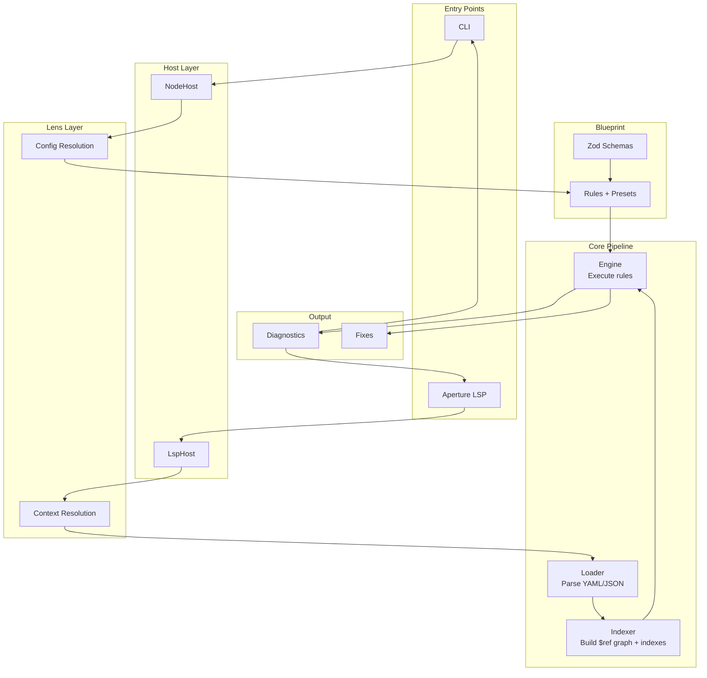

# Telescope OpenAPI Lint

Telescope is a greenfield OpenAPI linting tool that shares a single pipeline between a Bun-based CLI and the Aperture VS Code language server. Every package in this monorepo plugs into one stage of the pipeline, so the same semantics power both automation and in-editor feedback.

## Highlights

- Shared loader → graph → indexer → engine pipeline for consistent diagnostics across tools
- Project-aware linting with fragment and multi-root modes for large API workspaces
- Strongly typed rule authoring powered by Zod schemas for OpenAPI 3.0/3.1/3.2
- Bun-first workflow for installs, scripts, tests, and packaging
- Rich fixture catalog under `packages/examples` for regression coverage

## Monorepo layout

- `packages/aperture` – VS Code language server + client (legacy LSP + Volar experimental stack)
- `packages/blueprint` – strongly-typed OpenAPI schemas (Zod) + rule catalog and presets
- `packages/cli` – Bun CLI entrypoint with built-in formatters
- `packages/engine` – rule API, runner, visitor wiring, and fixes
- `packages/examples` – shared OpenAPI fixtures for tests and demos
- `packages/host` – virtual filesystem adapters for Node and VS Code
- `packages/indexer` – reverse lookups, typed references, and `$ref` dependency graph
- `packages/lens` – document lint orchestration, workspace discovery, and configuration resolution
- `packages/loader` – YAML/JSON parsing, source maps, and document detection

## How the pipeline fits together



For a detailed architecture diagram showing exact package interactions and data flow, see [ARCHITECTURE.md](./ARCHITECTURE.md).

## Quickstart

```bash
# install dependencies
bun install

# lint an OpenAPI document from the repo root
bun run --filter cli lint path/to/openapi.yaml

# run the full test suite (unit + integration fixtures)
bun test
```

Prefer Bun commands wherever possible—scripts, testing, and dev tooling are all wired for Bun.

## Workspace scripts

- `bun install` – install all workspace dependencies
- `bun run --filter ./packages/** build` – run package build scripts where defined (e.g. `bun run --filter aperture build` to emit legacy + Volar bundles)
- `bun run --filter ./packages/** test` – execute package-level tests
- `bun run --filter <package> <script>` – target a specific workspace package, e.g. `bun run --filter cli lint`

## Aperture language server

The Aperture extension (`packages/aperture`) reuses this pipeline to surface diagnostics inside VS Code. When it activates it:

1. Discovers workspace entrypoints via `packages/lens`
2. Streams documents through the shared host/loader/graph/indexer stack
3. Filters rules based on the current linting mode (project, fragment, multi-root)
4. Returns diagnostics and quick-fix metadata back to the editor

Use VS Code’s “Run Extension” launch target to develop Aperture locally (details in `packages/aperture/README.md`). Set the VS Code setting `aperture.experimental.useVolar` to opt into the Volar-based server after building with `bun run --filter aperture build`.

## Rules and presets

`packages/blueprint` contains both the OpenAPI schemas and the rule implementations, publishing presets such as `recommended31`. Configuration resolution lives in `packages/lens`, which materializes presets plus overrides into runnable rule objects for the engine.

To enable or disable rules, extend the default config and re-run either the CLI or the LSP—both consume the same configuration logic.

## Contributing

- Keep edits ASCII-only unless a file already relies on Unicode
- Prefer Bun equivalents over Node/npm/pnpm/vite when running scripts
- Add or update fixtures in `packages/examples` when introducing new validation behavior
- Place new rules under `packages/blueprint/rules` and re-export them through the preset metadata in `packages/blueprint/rules/presets.ts`

Happy linting!
