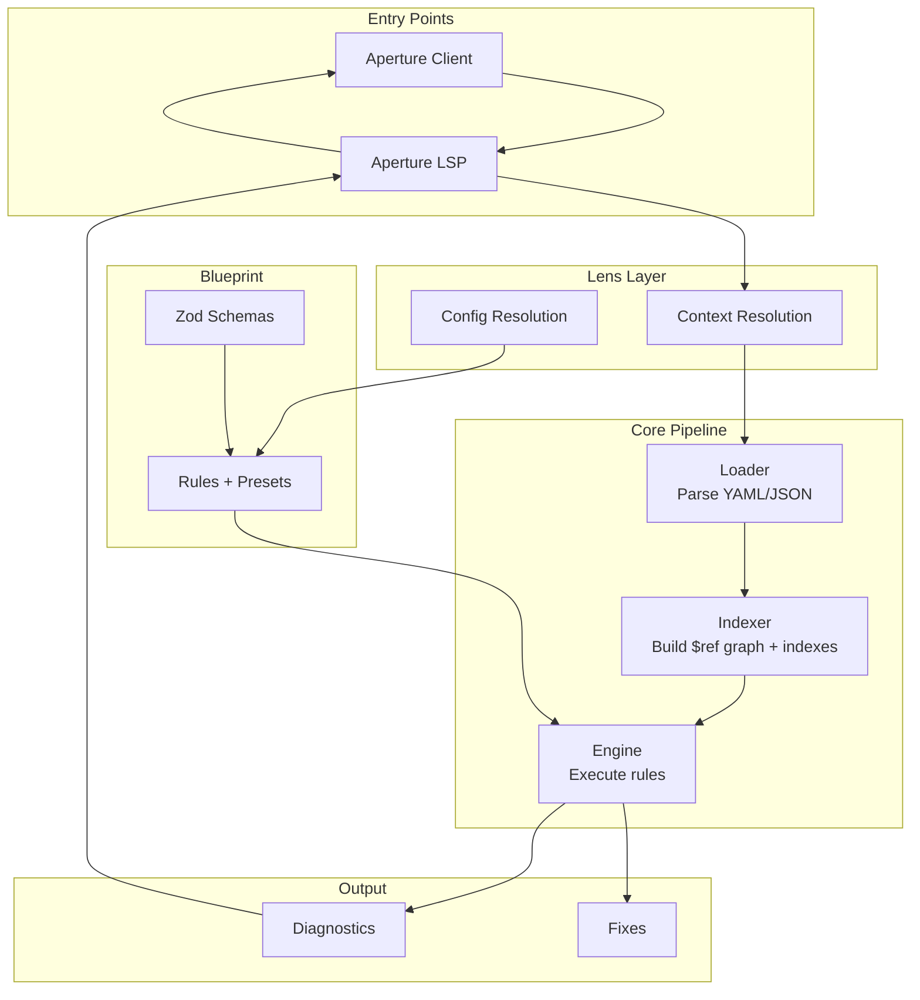

# Telescope OpenAPI Lint

Telescope is a greenfield OpenAPI linting tool powered by the Aperture VS Code language server. Every package in this monorepo plugs into one stage of the pipeline, so the same semantics power in-editor feedback.

## Highlights

- Shared loader → graph → indexer → engine pipeline for consistent diagnostics across tools
- Project-aware linting with fragment and multi-root modes for large API workspaces
- Strongly typed rule authoring powered by Zod schemas for OpenAPI 3.0/3.1/3.2
- Bun-first workflow for installs, scripts, tests, and packaging
- Rich fixture catalog under `packages/test-files` for regression coverage

## Monorepo layout

- `packages/aperture-client` – VS Code extension client that launches the language server
- `packages/aperture-lsp` – Volar-based language server implementing the LSP protocol
- `packages/blueprint` – strongly-typed OpenAPI schemas (Zod) + rule catalog and presets
- `packages/engine` – rule API, runner, visitor wiring, and fixes
- `packages/indexer` – reverse lookups, typed references, and `$ref` dependency graph
- `packages/lens` – document lint orchestration, workspace discovery, and configuration resolution
- `packages/test-files` – shared OpenAPI fixtures for tests and demos

## How the pipeline fits together



For a detailed architecture diagram showing exact package interactions and data flow, see [ARCHITECTURE.md](./ARCHITECTURE.md).

## Quickstart

```bash
# install dependencies
bun install

# run the full test suite (unit + integration fixtures)
bun test
```

Prefer Bun commands wherever possible—scripts, testing, and dev tooling are all wired for Bun.

## Workspace scripts

- `bun install` – install all workspace dependencies
- `bun run --filter ./packages/** build` – run package build scripts where defined (e.g. `bun run --filter aperture-client build` to build the VS Code extension)
- `bun run --filter ./packages/** test` – execute package-level tests
- `bun run --filter <package> <script>` – target a specific workspace package

## Aperture language server

The Aperture VS Code extension consists of two packages:

- **`packages/aperture-client`** – VS Code extension that launches and communicates with the language server
- **`packages/aperture-lsp`** – Volar-based language server that implements the LSP protocol

When the extension activates, the language server:

1. Auto-discovers workspace root documents via `packages/lens`
2. Streams documents through the shared host/loader/graph/indexer stack
3. Filters rules based on the current linting mode (project, fragment, multi-root)
4. Returns diagnostics and quick-fix metadata back to the editor

Use VS Code's "Run Extension" launch target to develop Aperture locally. Build both packages with `bun run --filter aperture-client build` and `bun run --filter aperture-lsp build` (see individual READMEs for details).

## Building and Publishing the VS Code Extension

### Prerequisites

1. **Install dependencies:**
   ```bash
   bun install
   ```

2. **Install VS Code Extension Manager (`vsce`):**
   ```bash
   bun add -g @vscode/vsce
   ```
   Or use npm if preferred:
   ```bash
   npm install -g @vscode/vsce
   ```

### Building the Extension

The Aperture extension consists of two packages that must be built before packaging:

1. **Build the language server:**
   ```bash
   bun run --filter aperture-lsp build
   ```
   This creates `packages/aperture-lsp/out/server.js` using Rollup.

2. **Build the VS Code client:**
   ```bash
   bun run --filter aperture-client build
   ```
   This compiles TypeScript to `packages/aperture-client/out/extension.js`.

3. **Verify both builds succeeded:**
   ```bash
   test -f packages/aperture-lsp/out/server.js && test -f packages/aperture-client/out/extension.js && echo "✅ Build complete"
   ```

### Packaging the Extension

Before packaging, ensure the `package.json` in `packages/aperture-client` has:
- Correct `version` field
- `private: false` (or remove the `private` field) for publishing
- All required metadata (`displayName`, `description`, `publisher`, etc.)

1. **Navigate to the client package:**
   ```bash
   cd packages/aperture-client
   ```

2. **Package the extension:**
   ```bash
   vsce package
   ```
   This creates a `.vsix` file (e.g., `aperture-0.0.1.vsix`) in the `packages/aperture-client` directory.

   **Note:** The extension references the language server at `../aperture-lsp/out/server.js`. When packaging, ensure the server build output is accessible relative to the client package, or update the server path resolution in `src/extension.ts` to bundle the server within the extension.

3. **Test the packaged extension locally:**
   ```bash
   code --install-extension aperture-0.0.1.vsix
   ```

### Publishing to VS Code Marketplace

1. **Get a Personal Access Token (PAT):**
   - Go to https://dev.azure.com
   - Sign in with your Microsoft account (or create one)
   - Navigate to User Settings → Personal Access Tokens
   - Create a new token with "Marketplace (Manage)" scope
   - Save the token securely

2. **Create a publisher (if you don't have one):**
   - Go to https://marketplace.visualstudio.com/manage
   - Sign in and create a new publisher
   - Note your publisher ID

3. **Update `package.json` with publisher information:**
   ```json
   {
     "publisher": "your-publisher-id",
     "version": "0.0.1"
   }
   ```

4. **Publish the extension:**
   ```bash
   cd packages/aperture-client
   vsce publish -p <your-personal-access-token>
   ```
   Or set the token as an environment variable:
   ```bash
   export VSCE_PAT=<your-personal-access-token>
   vsce publish
   ```

5. **Verify publication:**
   - Check https://marketplace.visualstudio.com/manage
   - Your extension should appear in your publisher dashboard
   - It may take a few minutes to appear in search results

### Publishing to Eclipse Marketplace

The Eclipse Marketplace accepts VS Code extensions, but requires additional steps:

1. **Create an Eclipse account:**
   - Sign up at https://accounts.eclipse.org/user/register

2. **Prepare marketplace metadata:**
   - Create a marketplace listing at https://marketplace.eclipse.org/content/add
   - Fill in extension details, screenshots, and documentation

3. **Upload the `.vsix` file:**
   - Use the Eclipse Marketplace web interface to upload your packaged `.vsix` file
   - The marketplace will validate and process the extension

4. **Alternative: Use Eclipse's VS Code extension support:**
   - Eclipse Theia and other Eclipse-based editors can install VS Code extensions directly
   - Users can install from the VS Code Marketplace URL
   - Some Eclipse distributions may require repackaging

### Troubleshooting

- **Build errors:** Ensure all workspace dependencies are installed with `bun install` from the repo root
- **Packaging errors:** Verify both `aperture-client` and `aperture-lsp` builds completed successfully
- **Server path issues:** The extension expects the server at `../aperture-lsp/out/server.js`. If packaging fails, you may need to copy the server build into the client package or adjust the path resolution
- **Publishing errors:** Ensure your PAT has the correct scopes and hasn't expired
- **Version conflicts:** Increment the `version` in `package.json` before republishing

## Rules and presets

`packages/blueprint` contains both the OpenAPI schemas and the rule implementations, publishing presets such as `recommended31`. Configuration resolution lives in `packages/lens`, which materializes presets plus overrides into runnable rule objects for the engine.

To enable or disable rules, extend the default config and re-run the LSP—it consumes the configuration logic.

## Contributing

- Keep edits ASCII-only unless a file already relies on Unicode
- Prefer Bun equivalents over Node/npm/pnpm/vite when running scripts
- Add or update fixtures in `packages/test-files` when introducing new validation behavior
- Place new rules under `packages/blueprint/rules` and re-export them through the preset metadata in `packages/blueprint/rules/presets.ts`

Happy linting!
