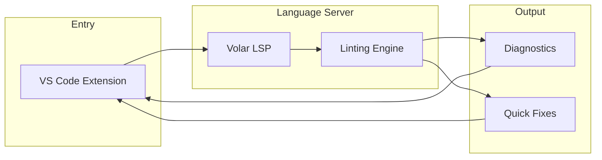

# Telescope

[](LICENSE)
[](https://marketplace.visualstudio.com/items?itemName=sailpoint.telescope)

**Telescope** is a powerful OpenAPI linting tool with real-time VS Code integration. It provides comprehensive validation, custom rule support, and multi-file project awareness.

## Features

### Validation & Diagnostics

- **Real-time Diagnostics** - See linting issues as you type in VS Code
- **30 Built-in OpenAPI Rules** - Best practices (and **52 total** when SailPoint rules are enabled)
- **Multi-file Support** - Full `$ref` resolution across your API project
- **Custom Rules** - Extend with your own TypeScript rules and Zod schemas
- **Pattern Matching** - Glob-based file inclusion/exclusion

### Code Intelligence

- **Go to Definition** - Navigate to `$ref` targets, operationId definitions, security schemes
- **Find All References** - Find all usages of schemas, components, and operationIds
- **Hover Information** - Preview referenced content inline
- **Completions** - Smart suggestions for `$ref` values, status codes, media types, tags
- **Rename Symbol** - Safely rename operationIds and components across your workspace
- **Call Hierarchy** - Visualize component reference relationships

### Editor Features

- **Code Lens** - Reference counts, response summaries, security indicators
- **Inlay Hints** - Type hints for `$ref` targets, required property markers
- **Semantic Highlighting** - Enhanced syntax highlighting for OpenAPI elements
- **Quick Fixes** - Auto-add descriptions, summaries, operationIds; convert to kebab-case
- **Document Links** - Clickable `$ref` links with precise navigation
- **Workspace Symbols** - Search operations and components across all files

### Embedded Language Support

- **Markdown in Descriptions** - Full language support with link validation
- **Code Block Highlighting** - Syntax highlighting for 21+ languages in fenced blocks
- **Format Conversion** - Convert between JSON and YAML with a single command

See [docs/LSP-FEATURES.md](docs/LSP-FEATURES.md) for the complete feature reference.

## Quick Start

### Install the VS Code Extension

Search for "Telescope" in the VS Code marketplace, or install from the command line:

```bash
code --install-extension sailpoint.telescope
```

### Configuration

Create `.telescope/config.yaml` in your project root:

```yaml
openapi:
  patterns:
    - "**/*.yaml"
    - "**/*.yml"
    - "**/*.json"
    - "!**/node_modules/**"

  # Enable SailPoint-specific rules
  sailpoint: true

  # Override rule severities
  rulesOverrides:
    operation-summary: warn
    parameter-description: error
```

See [docs/CONFIGURATION.md](docs/CONFIGURATION.md) for the full configuration reference.

### OpenAPI detection (high-level)

- Files are discovered repo-wide using your configured `openapi.patterns`.
- Files are classified as OpenAPI using a lightweight check for the `openapi` (3.x) or `swagger` (2.0) root key.
- When you open a classified file, the extension applies the custom language mode (`openapi-yaml` / `openapi-json`) for correct tokenization and grammars.

### Supported specifications

- Swagger 2.0
- OpenAPI 3.0.x
- OpenAPI 3.1.x
- OpenAPI 3.2.x

### Multi-root workspaces

Multi-root workspaces are supported. Telescope runs **one language server per workspace folder** to keep projects isolated.

### Debug logging

Use the `telescope.trace` setting to control LSP trace logging. Keep it `off` unless you’re actively debugging.

## Architecture

Telescope uses a unified pipeline for consistent diagnostics:

```
Document → Loader → Indexer → Engine → Diagnostics
```


```mermaid
flowchart LR
    subgraph Entry["Entry"]
        Client[VS Code Extension]
    end

    subgraph Server["Language Server"]
        LSP[Volar LSP]
        Engine[Linting Engine]
    end

    subgraph Output["Output"]
        Diag[Diagnostics]
        Fixes[Quick Fixes]
    end

    Client --> LSP --> Engine --> Diag --> Client
    Engine --> Fixes --> Client
```

For detailed architecture documentation, see [ARCHITECTURE.md](ARCHITECTURE.md).

## Monorepo Structure

| Package                                         | Description                            |
| ----------------------------------------------- | -------------------------------------- |
| [`telescope-client`](packages/telescope-client) | VS Code extension client               |
| [`telescope-server`](packages/telescope-server) | Volar language server + linting engine |
| [`test-files`](packages/test-files)             | Test fixtures and custom rule examples |

## Built-in Rules

Telescope includes **30** built-in OpenAPI best practice rules. If you enable `openapi.sailpoint: true`, it also enables **22** additional SailPoint-specific rules (**52 total**):

| Category   | Rules                                                  |
| ---------- | ------------------------------------------------------ |
| Core       | `$ref` cycle detection, unresolved reference checking  |
| Operations | operationId, summary, tags, descriptions, responses    |
| Parameters | required fields, examples, descriptions, formats       |
| Schemas    | structure validation, allOf, required arrays, defaults |
| Components | naming conventions                                     |

See [RULES.md](packages/telescope-server/src/engine/rules/RULES.md) for the complete rule reference.

## CLI (CI / local linting)

The `telescope-server` package also ships a small CLI (used by CI) with three subcommands:

- `telescope lint` - Lint a workspace/root document and print results (supports `--format json|github`)
- `telescope ci` - CI-oriented mode (report files, PR comments, diff modes)
- `telescope lsp` - Start the language server over stdio

From this repo (without installing globally), you can run it directly:

```bash
# Back-compat: running without a subcommand behaves like `telescope lint`
bun packages/telescope-server/src/cli/index.ts --workspace . --format github

# Explicit subcommands
bun packages/telescope-server/src/cli/index.ts lint --workspace . --format json
bun packages/telescope-server/src/cli/index.ts ci --workspace . --report-md telescope-report.md
```

## Custom Rules

Create custom rules in `.telescope/rules/`:

```typescript
// .telescope/rules/require-contact.ts
import { defineRule } from "telescope-server";

export default defineRule({
  meta: {
    id: "require-contact",
    number: 1000,
    description: "API must include contact information",
    type: "problem",
    fileFormats: ["yaml", "yml", "json"],
  },
  check(ctx) {
    return {
      Info(info) {
        if (!info.contact) {
          ctx.report({
            message: "Info section must include contact details",
            severity: "error",
            uri: info.uri,
            range: ctx.locate(info.uri, info.pointer),
          });
        }
      },
    };
  },
});
```

See [docs/CUSTOM-RULES.md](docs/CUSTOM-RULES.md) for the full custom rules guide.

## Development

```bash
# Install dependencies
pnpm install

# Run unit tests
bun test

# Build all packages
pnpm build

# VS Code extension E2E (integration) tests
# (downloads a VS Code build into packages/telescope-client/.vscode-test)
pnpm --filter telescope-client test:e2e:compile
pnpm --filter telescope-client test:e2e:run:single
pnpm --filter telescope-client test:e2e:run:multi

# Run the extension locally (VS Code)
# Press F5 to launch Extension Development Host
```

See [CONTRIBUTING.md](CONTRIBUTING.md) for development guidelines.

## Documentation

- [LSP Features Reference](docs/LSP-FEATURES.md)
- [CI (GitHub Actions)](docs/CI.md)
- [Configuration Reference](docs/CONFIGURATION.md)
- [Custom Rules Guide](docs/CUSTOM-RULES.md)
- [Publishing Guide](docs/PUBLISHING.md)
- [Architecture](ARCHITECTURE.md)
- [Built-in Rules](packages/telescope-server/src/engine/rules/RULES.md)
- [Contributing](CONTRIBUTING.md)

## License

[MIT](LICENSE) - Copyright (c) 2026 SailPoint Technologies
