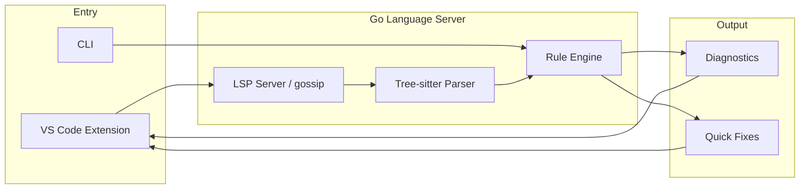

# Telescope

[](LICENSE)
[](https://marketplace.visualstudio.com/items?itemName=sailpoint.telescope)

**Telescope** is a powerful OpenAPI linting tool with real-time VS Code integration. It provides comprehensive validation, custom rule support, and multi-file project awareness.

## Features

### Validation & Diagnostics

- **Real-time Diagnostics** - See linting issues as you type in VS Code
- **65+ Built-in OpenAPI Rules** - Comprehensive validation covering naming, structure, security, paths, and OWASP
- **Multi-file Support** - Full `$ref` resolution across your API project
- **Custom Rules** - Extend with Go plugin binaries or Spectral-compatible YAML rulesets
- **Pattern Matching** - Glob-based file inclusion/exclusion

### Code Intelligence

- **Go to Definition** - Navigate to `$ref` targets, operationId definitions, security schemes
- **Find All References** - Find all usages of schemas, components, and operationIds
- **Hover Information** - Preview referenced content inline
- **Completions** - Smart suggestions for `$ref` values, status codes, media types, tags
- **Rename Symbol** - Safely rename operationIds and components across your workspace
- **Call Hierarchy** - Visualize component reference relationships

### Editor Features

- **Code Lens** - Reference counts, response summaries, security indicators
- **Inlay Hints** - Type hints for `$ref` targets, required property markers
- **Semantic Highlighting** - Enhanced syntax highlighting for OpenAPI elements
- **Quick Fixes** - Auto-add descriptions, summaries, operationIds; convert to kebab-case
- **Document Links** - Clickable `$ref` links with precise navigation
- **Workspace Symbols** - Search operations and components across all files

### Embedded Language Support

- **Markdown in Descriptions** - Full language support with link validation
- **Code Block Highlighting** - Syntax highlighting for 21+ languages in fenced blocks
- **Format Conversion** - Convert between JSON and YAML with a single command

See [docs/LSP-FEATURES.md](docs/LSP-FEATURES.md) for the complete feature reference.

## Quick Start

### Install the VS Code Extension

Search for "Telescope" in the VS Code marketplace, or install from the command line:

```bash
code --install-extension sailpoint.telescope
```

### Configuration

Create `.telescope.yaml` in your project root:

```yaml
extends: telescope:recommended

rules:
  operation-summary: warn
  parameter-description: error

include:
  - "**/*.yaml"
  - "**/*.yml"
  - "**/*.json"

exclude:
  - "**/node_modules/**"
```

See [docs/CONFIGURATION.md](docs/CONFIGURATION.md) for the full configuration reference.

### OpenAPI detection (high-level)

- Files are discovered repo-wide using your configured `include` patterns.
- Files are classified as OpenAPI using a lightweight check for the `openapi` (3.x) or `swagger` (2.0) root key.
- When you open a classified file, the extension applies the custom language mode (`openapi-yaml` / `openapi-json`) for correct tokenization and grammars.

### Supported specifications

- Swagger 2.0
- OpenAPI 3.0.x
- OpenAPI 3.1.x
- OpenAPI 3.2.x

### Multi-root workspaces

Multi-root workspaces are supported. Telescope runs **one language server per workspace folder** to keep projects isolated.

### Debug logging

Use the `telescope.trace` setting to control LSP trace logging. Keep it `off` unless you're actively debugging.

## Architecture

Telescope is built as a Go language server with a VS Code extension client:

```
Document (YAML/JSON)
  → Tree-sitter incremental parse
  → OpenAPI index (typed model)
  → Rule execution (analyzers + plugins + spectral)
  → Diagnostics with precise source locations
  → VS Code / CLI output
```


```mermaid
flowchart LR
    subgraph Entry["Entry"]
        Client[VS Code Extension]
        CLI[CLI]
    end

    subgraph Server["Go Language Server"]
        LSP[LSP Server / gossip]
        TS[Tree-sitter Parser]
        Engine[Rule Engine]
    end

    subgraph Output["Output"]
        Diag[Diagnostics]
        Fixes[Quick Fixes]
    end

    Client --> LSP
    CLI --> Engine
    LSP --> TS --> Engine --> Diag --> Client
    Engine --> Fixes --> Client
```

For detailed architecture documentation, see [ARCHITECTURE.md](ARCHITECTURE.md).

## Repository Structure

| Directory | Description |
| --------- | ----------- |
| [`server/`](server/) | Go language server, CLI, and linting engine |
| [`packages/telescope-client`](packages/telescope-client) | VS Code extension client |
| [`packages/telescope-server`](packages/telescope-server) | Legacy TypeScript language server |
| [`packages/test-files`](packages/test-files) | Test fixtures and examples |

## Built-in Rules

Telescope includes **65+** built-in OpenAPI rules organized into rulesets:

| Ruleset | Description |
| ------- | ----------- |
| `telescope:recommended` | ~35 curated rules for most projects |
| `telescope:all` | All ~65 rules enabled |
| `telescope:owasp` | 15 OWASP security rules |
| `telescope:strict` | Recommended + OWASP with stricter severities |

| Category | Rules |
| -------- | ----- |
| Core | `$ref` cycle detection, unresolved reference checking |
| Operations | operationId, summary, tags, descriptions, responses |
| Parameters | required fields, examples, descriptions, formats |
| Schemas | structure validation, allOf, required arrays, defaults |
| Components | naming conventions |
| Security | OWASP API security best practices |

## CLI

The Go server ships a CLI with three subcommands:

```bash
# Lint files
telescope lint api.yaml
telescope lint ./specs/ --format json
telescope lint --severity warn --fail-on error

# CI mode (diff-aware, PR comments)
telescope ci --diff-base main --comment-pr

# Start LSP server
telescope serve              # stdio (default)
telescope serve --tcp :9257  # TCP
```

Output formats: `text`, `json`, `sarif`, `github` (GitHub Actions annotations).

## Custom Rules

Custom rules are written as **Go plugin binaries** using the Telescope SDK:

```go
package main

import "github.com/sailpoint-oss/telescope/server/sdk"

func main() {
    p := sdk.NewPlugin("my-rules", "1.0.0")

    sdk.Rule("require-security", sdk.Meta{
        Description: "All operations must define a security requirement",
        Severity:    sdk.Error,
        Category:    sdk.Security,
    }).Operations(func(path, method string, op *sdk.Operation, r *sdk.Reporter) {
        if len(op.Security) == 0 {
            r.At(op.Loc, "%s %s has no security requirement defined", method, path)
        }
    }).Register(p)

    p.Serve()
}
```

Build and deploy to `.telescope/plugins/`. Spectral-compatible YAML rulesets are also supported.

See [server/README.md](server/README.md) for the full Go plugin SDK reference and [docs/CUSTOM-RULES.md](docs/CUSTOM-RULES.md) for more details.

## Development

```bash
# Go server
cd server
go build ./...
go test -race ./... -timeout 10m

# TypeScript packages
pnpm install
pnpm build
bun test packages/telescope-server

# VS Code extension E2E (integration) tests
pnpm --filter telescope-client test:e2e:compile
pnpm --filter telescope-client test:e2e:run:single
pnpm --filter telescope-client test:e2e:run:multi

# Run the extension locally (VS Code)
# Press F5 to launch Extension Development Host
```

See [CONTRIBUTING.md](CONTRIBUTING.md) for development guidelines.

## Documentation

- [Server & SDK Reference](server/README.md)
- [LSP Features Reference](docs/LSP-FEATURES.md)
- [CI (GitHub Actions)](docs/CI.md)
- [Configuration Reference](docs/CONFIGURATION.md)
- [Custom Rules Guide](docs/CUSTOM-RULES.md)
- [Publishing Guide](docs/PUBLISHING.md)
- [Architecture](ARCHITECTURE.md)
- [Contributing](CONTRIBUTING.md)

## License

[MIT](LICENSE) - Copyright (c) 2026 SailPoint Technologies
