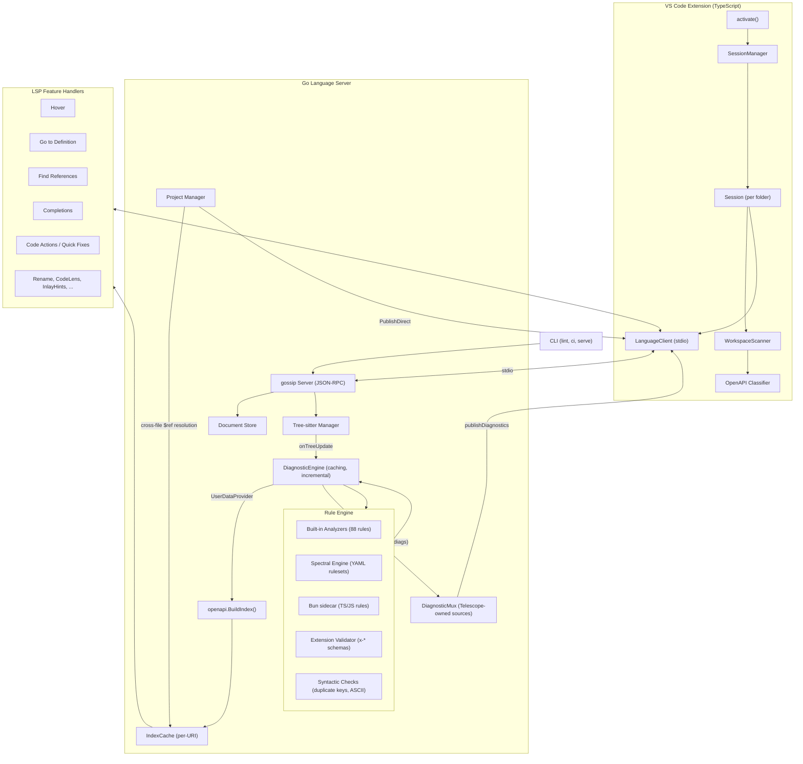

# Telescope

[](LICENSE)
[](https://marketplace.visualstudio.com/items?itemName=SailPointTechnologies.telescope-openapi)

**Telescope** is the spec-side editor, CLI, and custom-rule experience layer for the OpenAPI toolchain. It combines Navigator-backed document validation, Barrelman-backed rule execution, and Telescope-owned VS Code/LSP UX for multi-file API-description workspaces.

## Features

### Validation & Diagnostics

- **Real-time Diagnostics** - See linting issues as you type in VS Code
- **Navigator-backed Structural Diagnostics** - Canonical parse, schema-shape, and meta-schema issues surfaced live in the editor
- **88 Built-in OpenAPI Rules** - Barrelman-backed lint coverage for naming, security, paths, documentation, and OWASP guidance
- **Multi-file Support** - Full `$ref` resolution across your API project
- **Custom Rules** - YAML rules in config, Bun sidecar TypeScript/JavaScript rules, and Spectral-compatible YAML rulesets
- **Pattern Matching** - Glob-based file inclusion/exclusion

### Code Intelligence

- **Go to Definition** - Navigate to `$ref` targets, operationId definitions, security schemes
- **Find All References** - Find all usages of schemas, components, and operationIds
- **Hover Information** - Preview referenced content inline
- **Completions** - Smart suggestions for `$ref` values, status codes, media types, tags, and common vendor extensions
- **Rename Symbol** - Safely rename operationIds and components across your workspace
- **Call Hierarchy** - Visualize component reference relationships

### Editor Features

- **Code Lens** - Reference counts, response summaries, security indicators
- **Bundle Preview** - Workspace-aware multi-file bundle previews directly from the editor
- **Inlay Hints** - Type hints for `$ref` targets, required property markers
- **Semantic Highlighting** - Enhanced syntax highlighting for OpenAPI elements
- **Quick Fixes** - Auto-add descriptions, summaries, operationIds; convert to kebab-case
- **Document Links** - Clickable `$ref`, markdown, and `externalDocs` links with precise navigation
- **Workspace Symbols** - Search operations and components across all files

### Embedded Language Support

- **Markdown in Descriptions** - Full language support with clickable http(s) and relative document links
- **Code Block Highlighting** - Syntax highlighting for 21+ languages in fenced blocks
- **Format Conversion** - Convert between JSON and YAML with a single command

See [docs/LSP-FEATURES.md](docs/LSP-FEATURES.md) for the complete feature reference.

## Quick Start

### Install the VS Code Extension

Telescope is published with different IDs depending on the distribution channel:

| Store | Extension ID | Install command |
| ----- | ------------ | --------------- |
| VS Code Marketplace | `SailPointTechnologies.telescope-openapi` | `code --install-extension SailPointTechnologies.telescope-openapi` |
| Open VSX / Cursor / VSCodium | `sailpoint.telescope` | `code --install-extension sailpoint.telescope` |

Platform-specific VSIXs that bundle the Telescope server are currently published for `darwin-arm64`, `darwin-x64`, `linux-x64`, and `win32-x64`.

The universal VSIX works on other platforms too, but it does not bundle the native `telescope` server. On those installs, provide the binary via `telescope.serverPath`, `TELESCOPE_SERVER_PATH`, or `PATH`.

### Configuration

Create `.telescope.yaml` in your project root. Telescope also supports `.telescope.yml`, `.telescope/config.yaml`, and `.telescope/config.yml`:

```yaml
extends: telescope:recommended

rules:
  operation-summary: warn
  parameter-description: error

include:
  - "**/*.yaml"
  - "**/*.yml"
  - "**/*.json"

exclude:
  - "**/node_modules/**"
```

See [docs/CONFIGURATION.md](docs/CONFIGURATION.md) for the full configuration reference.

### OpenAPI detection (high-level)

- Files are discovered repo-wide using your configured `include` patterns.
- Files are classified as OpenAPI using a lightweight check for the `openapi` (3.x) or `swagger` (2.0) root key.
- When you open a classified file, the extension applies the custom language mode (`openapi-yaml` / `openapi-json`) for correct tokenization and grammars.

### Supported specifications

- Swagger 2.0
- OpenAPI 3.0.x
- OpenAPI 3.1.x
- OpenAPI 3.2.x

### Toolchain ownership

- **Navigator** - Parse, index, schema/meta validation, fragment semantics, and canonical document issues for OpenAPI and Arazzo
- **Barrelman** - Shared lint/check execution and built-in rule catalogs
- **Barometer** - Contract-test HTTP execution; linked into the Telescope binary for in-process runs (no separate Barometer install)
- **Telescope** - VS Code client, LSP handlers, diagnostics aggregation, custom-rule runtimes, and spec-side CLI/editor UX

Contract tests are configured under `contractTests` in `.telescope.yaml` (base URL, credentials keyed by OpenAPI security scheme names, optional `envFiles` for dotenv, optional TLS/mTLS file paths, optional `strategy: oauth2ClientCredentials` / `oauth2Refresh` for token exchange, concurrency). Workspace `.env` / `.env.local` are loaded and reloaded when those files change (same watcher as Telescope config). Credential `*Env` keys resolve from dotenv first, then the process environment—align CI job `env` with those names. The editor runs tests asynchronously via LSP (`telescope.runContractTests`); the CLI runs the same engine with `telescope contract test <spec.yaml>`. See [docs/CONFIGURATION.md](docs/CONFIGURATION.md) (section **Contract tests**).

Use `Meridian` when you need codebase-side generation, extraction orchestration, or repo-scale report pipelines. Use Telescope when you already have workspace files in spec form and want linting, validation surfacing, and editor intelligence.

### Multi-root workspaces

Multi-root workspaces are supported. Telescope runs **one language server per workspace folder** to keep projects isolated.

### Debug logging

Use the `telescope.trace` setting to control LSP trace logging. Keep it `off` unless you're actively debugging.
For extension-host debugging, follow the end-to-end runbook in [docs/LSP-TRACE-RUNBOOK.md](docs/LSP-TRACE-RUNBOOK.md).
To merge collected logs into one sortable artifact, use [docs/LSP-TRACE-TIMELINE.md](docs/LSP-TRACE-TIMELINE.md).

## Architecture

Telescope is a Go language server built on the [gossip](https://github.com/LukasParke/gossip) LSP framework, paired with a TypeScript VS Code extension client. The server uses tree-sitter for incremental YAML/JSON parsing, Navigator for canonical OpenAPI indexing and validation, Barrelman for built-in rule execution, and Telescope-owned adapters to publish diagnostics back to the editor via the LSP push-diagnostic protocol (`textDocument/publishDiagnostics`).


```mermaid
flowchart TB
    subgraph client ["VS Code Extension (TypeScript)"]
        Activate["activate()"]
        SM["SessionManager"]
        Session["Session (per folder)"]
        Scanner["WorkspaceScanner"]
        Classifier["OpenAPI Classifier"]
        LC["LanguageClient (stdio)"]
    end

    subgraph server ["Go Language Server"]
        Gossip["gossip Server (JSON-RPC)"]
        DocStore["Document Store"]
        TSParser["Tree-sitter Manager"]
        IndexBuild["openapi.BuildIndex()"]
        IndexCache["IndexCache (per-URI)"]

        subgraph rules ["Rule Engine"]
            Analyzers["Built-in Analyzers (88 rules)"]
            Spectral["Spectral Engine (YAML rulesets)"]
            BunRules["Bun sidecar (TS/JS rules)"]
            ExtVal["Extension Validator (x-* schemas)"]
            Checks["Syntactic Checks (duplicate keys, ASCII)"]
        end

        DiagEngine["DiagnosticEngine (caching, incremental)"]
        ProjMgr["Project Manager"]

        DiagMux["DiagnosticMux (Telescope-owned sources)"]
    end

    subgraph features ["LSP Feature Handlers"]
        Hover["Hover"]
        Definition["Go to Definition"]
        References["Find References"]
        Completion["Completions"]
        CodeAction["Code Actions / Quick Fixes"]
        More["Rename, CodeLens, InlayHints, ..."]
    end

    CLI["CLI (lint, ci, serve)"]

    Activate --> SM --> Session
    Session --> Scanner --> Classifier
    Session --> LC

    LC <-->|"stdio"| Gossip
    CLI --> Gossip

    Gossip --> DocStore
    Gossip --> TSParser
    TSParser -->|"onTreeUpdate"| DiagEngine
    DiagEngine -->|"UserDataProvider"| IndexBuild
    IndexBuild --> IndexCache
    DiagEngine --> rules
    rules --> DiagEngine

    DiagEngine -->|"Set(uri, telescope, diags)"| DiagMux
    DiagMux -->|"publishDiagnostics"| LC

    ProjMgr -->|"cross-file $ref resolution"| IndexCache
    ProjMgr -->|"PublishDirect"| LC

    IndexCache --> features
    features <--> LC
```

### How it works

1. **Discovery and classification.** The VS Code extension runs a `SessionManager` that creates one `Session` per workspace folder. Each session spawns a `WorkspaceScanner` that discovers YAML/JSON files via glob patterns and classifies them as OpenAPI by checking for the `openapi` or `swagger` root key. When you open a classified file, the extension applies the `openapi-yaml` or `openapi-json` language mode.

2. **Parsing.** The `LanguageClient` connects to the Go server over stdio. The gossip framework receives `didOpen`/`didChange`/`didClose` notifications, stores documents in a thread-safe document store, and feeds them to tree-sitter for incremental parsing. Document lifecycle notifications are serialized via `docSyncMu` to prevent races during language reclassification.

3. **Indexing.** On every tree update, the `DiagnosticEngine` calls the `UserDataProvider`, which runs `openapi.BuildIndex(tree, doc)`. That compatibility layer keeps Telescope's existing typed surface while wrapping Navigator-backed document semantics, operations, components, tags, and `$ref` usages. Indexes are cached per-URI in the `IndexCache` with an on-demand builder fallback.

4. **Rule execution.** The `DiagnosticEngine` runs several categories of checks in parallel: Navigator-issued document issues, Barrelman-backed built-in analyzers/checks, Spectral-compatible YAML rulesets (JSONPath + built-in functions), Bun sidecar TypeScript/JavaScript rules, and Telescope's editor-facing extension schema validators. Each produces diagnostics with precise source locations.

5. **Diagnostic publishing.** Telescope diagnostics flow through a small internal `DiagnosticMux` that merges Telescope-owned sources such as rule-engine diagnostics and contract-test diagnostics before publishing them to the client via `textDocument/publishDiagnostics`. Generic YAML/JSON syntax feedback is left to the editor's own language services.

6. **Cross-file resolution.** The `Project Manager` runs a background workspace scan, builds a dependency graph of root documents and their transitive `$ref` targets, and provides a `CrossFileResolver` to the rule engine. This enables cross-file go-to-definition, find-references, and project-level diagnostics.

7. **Feature handlers.** All 24 LSP feature handlers (hover, definition, references, completions, rename, code actions, etc.) read from the `IndexCache` and optionally the `Project Manager` to provide code intelligence.

For detailed architecture documentation, see [ARCHITECTURE.md](ARCHITECTURE.md).

## Repository Structure

| Directory | Description |
| --------- | ----------- |
| [`server/`](server/) | Go language server, CLI, and linting engine |
| [`client`](client) | VS Code extension client |
| [`test-files`](test-files) | Test fixtures and examples |

## Built-in Rules

Telescope includes **88** built-in OpenAPI rules organized into rulesets:

| Ruleset | Description |
| ------- | ----------- |
| `telescope:recommended` | 50 curated rules for most projects |
| `telescope:all` | All 56 non-OWASP rules |
| `telescope:owasp` | 32 OWASP API security rules |
| `telescope:strict` | Recommended + OWASP combined |

| Category | Count | Examples |
| -------- | ----- | -------- |
| Structure | 14 | Structural/schema coverage surfaced through Navigator and Barrelman parity checks |
| Documentation | 17 | Descriptions, deprecation, markdown quality |
| Paths | 8 | Kebab-case, trailing slashes, parameter matching |
| Naming | 4 | Schema/example casing, operationId uniqueness |
| Security | 4 | API key placement, OAuth URLs, security requirements |
| Types | 4 | Format validation, example type/enum matching |
| Servers | 2 | Server definitions, HTTPS |
| References | 1 | Unresolved `$ref` detection |
| Syntax | 2 | Duplicate keys, ASCII |
| OWASP | 32 | Full Spectral OWASP v2.x parity |

See [docs/RULES.md](docs/RULES.md) for the complete rule reference with IDs and descriptions.

## CLI

The Go server ships a CLI with four main subcommands:

```bash
# Structural validation only
telescope validate api.yaml
telescope validate workflows.arazzo.yaml --format json

# Lint files (validation + configured rules)
telescope lint api.yaml
telescope lint ./specs/ --format json
telescope lint --severity warn --fail-on error

# CI mode (diff-aware, PR comments)
telescope ci --diff-base main --comment-pr

# Start LSP server
telescope serve              # stdio (default)
telescope serve --tcp :9257  # TCP
```

Output formats: `text`, `json`, `sarif`, `github` (GitHub Actions annotations).

`validate` is the structural/schema-only surface. `lint` runs the same validation layer plus configured Barrelman-backed rules. In the editor, Telescope also exposes a `Telescope: Run Contract Tests` command that runs in-process Barometer contract checks and Arazzo workflow runs against a base URL.

### GitHub Action

Use the reusable action when you want the same CLI contract in GitHub Actions:

```yaml
- uses: sailpoint-oss/telescope@main
  with:
    mode: ci
    paths: specs/
    comment-pr: true
    report-md: telescope-report.md
    report-json: telescope-report.json
```

## Custom Rules

Shared built-in rules live upstream in Barrelman. Telescope-specific extensions are for custom or editor-local behavior and can be written as **declarative YAML** in `.telescope.yaml`, **Bun sidecar rules**, or **Spectral-compatible YAML rulesets**:

```yaml
extends: telescope:recommended
spectralRulesets:
  - .telescope/company-rules.yaml
openapi:
  rules:
    - rule: my-rule
      severity: warn
      # ... declarative rule definition (see guide)
```

Place shared rule files under `.telescope/` and reference them from `.telescope.yaml`. See [docs/CUSTOM-RULES.md](docs/CUSTOM-RULES.md) for Spectral rules, Bun workflows, and YAML-native rules.

Bun is optional for Telescope's core parsing, linting, and LSP features. It is only required when you enable sidecar-backed TypeScript/JavaScript custom rules or Spectral rulesets.

The Go package [`server/sdk`](server/README.md) is for **programmatic linting** (`Workspace`) and type re-exports for embedders, not for Go plugin binaries.

## Development

```bash
# Go server
cd server
go build ./...                        # verify compilation
go test -race ./... -timeout 10m      # run all tests with race detection
go build -o ../client/bin/telescope . # build binary for VS Code extension

# VS Code extension
pnpm install
pnpm run build:sidecar                # bundle/copy sidecar runner.js for sidecar-backed rules
pnpm build

# E2E (integration) tests
pnpm --filter ./client test:e2e:compile
pnpm --filter ./client test:e2e:run:single
pnpm --filter ./client test:e2e:run:multi

# Full test suite (Go + E2E) in one command
cd server && go test -race ./... -timeout 10m && \
  cd ../.. && cd gossip && go test -race ./... -timeout 10m && \
  cd ../telescope && pnpm --filter ./client test:e2e:run:single && \
  pnpm --filter ./client test:e2e:run:multi

# Run the extension locally (VS Code)
# Press F5 to launch Extension Development Host
```

For sibling Go development across the toolchain, use a workspace `go.work` file from the parent directory:

```bash
go work init ./navigator ./barrelman ./telescope/server ./barometer
go work sync
```

See [CONTRIBUTING.md](CONTRIBUTING.md) for development guidelines.

## Release Coordination

- Telescope publishes through multiple workflows; see [docs/PUBLISHING.md](docs/PUBLISHING.md) for the exact triggers.
- When Navigator or Barrelman contracts change, update `server/go.mod`, run `go test -race ./... -timeout 10m`, and then run the relevant E2E suite from the `Development` section.
- Use `../navigator/TOOLCHAIN_BOUNDARIES.md` for bump order and `../navigator/TOOLCHAIN_FIXTURE_MATRIX.md` for cross-repo smoke anchors when coordinating a release train.

## Documentation

- [Server & SDK Reference](server/README.md)
- [Built-in Rules Reference](docs/RULES.md)
- [LSP Features Reference](docs/LSP-FEATURES.md)
- [CI (GitHub Actions)](docs/CI.md)
- [Configuration Reference](docs/CONFIGURATION.md)
- [Custom Rules Guide](docs/CUSTOM-RULES.md)
- [Publishing Guide](docs/PUBLISHING.md)
- [Architecture](ARCHITECTURE.md)
- [Contributing](CONTRIBUTING.md)

## License

[MIT](LICENSE) - Copyright (c) 2026 SailPoint Technologies
