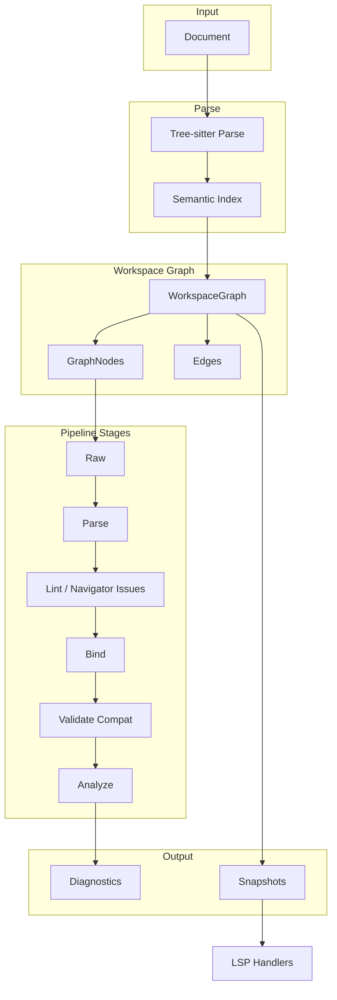
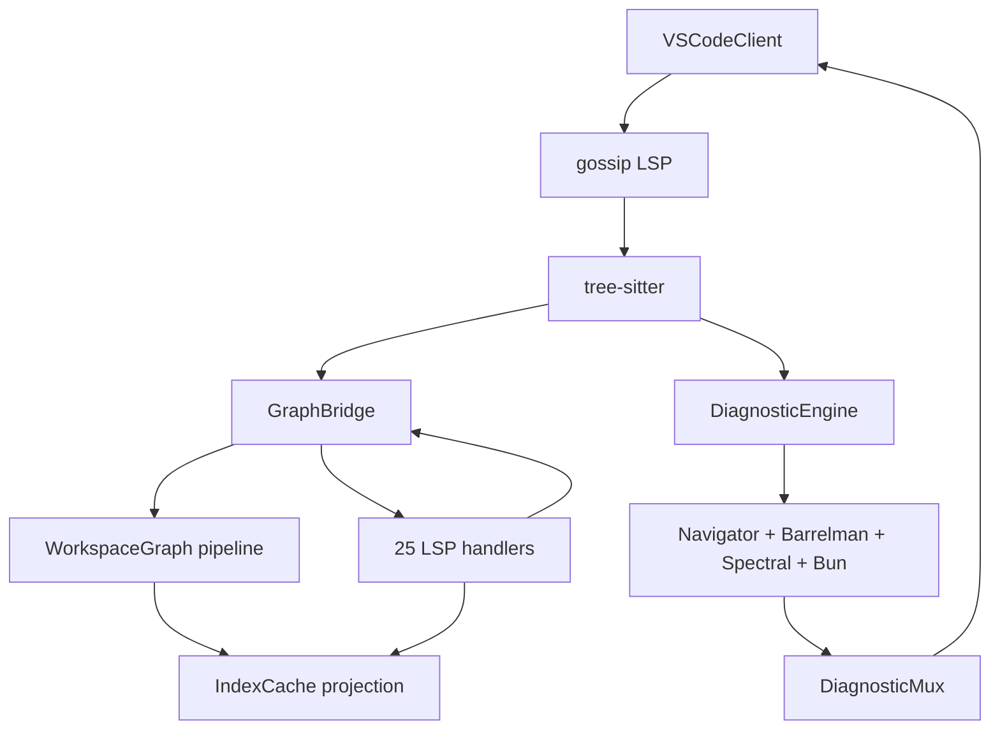

# Telescope Architecture

> **Scope:** Unified system architecture for contributors and maintainers. For file-level package map, see [CODEBASE-BREAKDOWN.md](CODEBASE-BREAKDOWN.md).

Telescope is the editor, CLI, and SDK experience layer for the shared OpenAPI toolchain. A **VS Code extension** (TypeScript) acts as the client; a **Go language server** on [gossip](https://github.com/LukasParke/gossip) with tree-sitter integration implements LSP, CLI, and batch lint. Navigator owns canonical OpenAPI parsing and validation; Barrelman owns shared built-in lint logic; Telescope owns editor-facing orchestration and UX.

## Overview

Telescope provides:

- **Linting** — Barrelman rules plus Navigator-backed structural diagnostics presented in CLI/LSP flows
- **Validation** — Shared structural/schema checks for OpenAPI and Arazzo without the full lint ruleset
- **Language Server** — Hover, completion, definition, references, rename, code actions, semantic tokens
- **CLI** — `validate`, `lint`, `ci`, and `serve` subcommands for local and CI workflows
- **Runtime surfacing** — Editor-triggered Barometer-backed OpenAPI contract checks and Arazzo workflow runs against workspace specs
- **SDK** — Programmatic access for tools that want Telescope's editor/CLI orchestration on top of Navigator + Barrelman

Telescope no longer carries a separate in-repo OpenAPI schema package; canonical schema truth now lives upstream with Navigator/Barrelman.

The V2 architecture centers on a **workspace graph** that models documents as nodes with directed edges for `$ref` relationships. Telescope uses Navigator's shared `raw -> parse -> bind` substrate for OpenAPI and Arazzo documents, consumes Navigator issues plus Barrelman rules, and layers user-facing editor/CLI workflows on top of that data.

## High-Level Architecture

**Data flow**: Document → Navigator index + graph substrate → Barrelman rules / Telescope orchestration → Diagnostics and editor features. The WorkspaceGraph maintains nodes, edges, and snapshots consumed by LSP handlers.

## Package Layout

| Package | Purpose |
|---------|---------|
| `core/types` | Protocol-independent types: `Diagnostic`, `Range`, `Position`, `Severity`, `DiagnosticTag` |
| `core/graph` | Workspace graph engine: `WorkspaceGraph`, `GraphNode`, `Edge`, `StageName`, `StageResult` |
| `core/graph` (source) | Document sources: `DocumentSource`, `FilesystemSource`, `SyntheticSource`, `LSPSource` |
| `core/graph` (pipeline) | Shared graph substrate and stage runner for `raw`, `parse`, and `bind` |
| `core/graph` (snapshot) | Immutable snapshots: `Snapshot`, `SnapshotManager`, `SnapshotNode` |
| `core/parser` | Semantic model: `SemanticNode`, `NodeKind`, YAML tree walking |
| `core/parser` (virtual) | Virtual documents: `VirtualDocument`, `VirtualDocumentManager`, `OffsetMapper` |
| `core/parser` (embedded) | Embedded content: `EmbeddedLanguageProvider`, `MarkdownProvider` |
| `core/classify` | File classification: `FileClassifier`, `FileClassification`, heuristic signals |
| `core/analyze` | Cross-document analysis: `FindUnusedComponents`, `DetectBreakingChanges`, `BundlePreview` |
| `sdk` | Public Go API: `Workspace`, `Option`, `AnalysisResult` |
| `lsp` | LSP server wiring, handlers, graph bridge |
| `lsp/adapt` | Type conversion: `core/types` ↔ `gossip/protocol` |
| `lsp/bun` | Bun sidecar for TypeScript/JavaScript custom rules and Spectral rulesets |
| `lsp/observe` | Observability: `GraphInfo`, `RulePerf`, `$/telescope/*` notifications |
| `rules` | Rule registry, `RuleBuilder`, `Reporter`, `Walker` |
| `rules/analyzers` | Barrelman-backed analyzer bridge plus built-in semantic rule registration |
| `rules/checks` | Syntactic checks (duplicate keys, ASCII, missing tokens) |
| `rules/testing` | Test harness: `rulestest.Run()` with exact diagnostic assertions |
| `spectral` | Spectral-compatible YAML rulesets (JSONPath + built-in functions) |
| `project` | Multi-file workspace: file discovery, dependency graph |
| `plugin` | In-process `Plugin` interface; YAML/Bun wiring (no Go plugin RPC) |
| `openapi` | Compatibility layer around Navigator types used by existing Telescope surfaces |
| `config` | `.telescope/config.yaml` loading, ruleset merging |
| `extensions` | `x-*` vendor extension schema validation and completion metadata |
| `markdown` | Markdown parsing/validation in description fields |
| `validation` | Additional JSON Schema validation for non-OpenAPI files |

## Data Flow

### Document Lifecycle

1. **Open** — Document enters via `DocumentSource` (filesystem, LSP overlay, or synthetic). Added to `WorkspaceGraph` via `AddSource`.
2. **Classify** — `FileClassifier` uses heuristics (root key, fingerprint, extension, config override, graph membership) to determine if the file is OpenAPI and whether it is a root or fragment.
3. **Parse** — `RawStage` reads content from the source; `ParseStage` builds the Navigator-backed semantic index.
4. **Bind** — `$ref` resolution; edges materialized in the graph (`EdgeRef`, `EdgePathRef`, `EdgeExternal`).
5. **Lint / Validate / Analyze** — Higher-level Telescope workflows run on top of parsed/bound documents. Navigator owns parse-time issues, Barrelman owns shared rule execution, and Telescope owns presentation, aggregation, and editor-facing orchestration.
6. **Diagnostics** — Stored per-node; aggregated in `Snapshot` for LSP/CLI output.

### Invalidation

When a document changes, `Invalidate(uri)` marks all stages dirty for that URI and cascades to dependents (documents that reference it). Pipeline stages re-run only for dirty nodes; cached results are reused when `StageResult.Version` matches `GraphNode.Version`.

## Core Abstractions

### Protocol-Independent Types (`core/types`)

- **`Diagnostic`** — Range, severity, code, message, tags, related info, optional fix
- **`Range`** — Start/end `Position` (0-based line, character)
- **`Severity`** — Error, Warning, Info, Hint
- **`DiagnosticTag`** — Unnecessary, Deprecated

These types are used throughout the core engine. The `lsp/adapt` package converts to/from `gossip/protocol` types at the LSP boundary.

### Workspace Graph (`core/graph`)

- **`WorkspaceGraph`** — Thread-safe directed graph: nodes (documents), edges (`$ref` relationships), roots
- **`GraphNode`** — Per-document state: source, version, raw bytes, stage results, dirty flags, diagnostics
- **`Edge`** — Source/target URI + JSON pointers, `EdgeKind` (Ref, Component, External)
- **`ReadOnlyGraph`** — Interface for SDK consumers to query the graph without mutating

### Document Sources

| Source | Use Case |
|--------|----------|
| `FilesystemSource` | CLI, file watcher |
| `LSPSource` | LSP document overlays (gossip `document.Store`) |
| `SyntheticSource` | SDK — programmatic injection |

### Pipeline Stages

| Stage | Depends On | Purpose |
|-------|------------|---------|
| `StageRaw` | — | Read content from `DocumentSource` |
| `StageParse` | Raw | Tree-sitter + Navigator parse, semantic index, pointer metadata |
| `StageBind` | Lint | `$ref` resolution, edge materialization |
| `StageLint` | Parse | Surface Navigator syntax / structural / schema / meta issues |
| `StageValidate` | Bind | Compatibility pass-through stage for consumers using the legacy topology |
| `StageAnalyze` | Validate | Cross-document analysis such as unused components, breaking changes, and bundle views |

### Virtual Document System

Embedded content (e.g., Markdown in `description` fields) is extracted as **virtual documents** with synthetic URIs (`vdoc://parent#/paths/~1users/get/description`). `VirtualDocumentManager` maintains them; `OffsetMapper` translates positions between virtual and source. Used for hover/completion in embedded Markdown.

### File Classification

`FileClassifier` uses weighted signals:

- Config override (glob → isOpenAPI) — weight 1.0
- Graph membership (referenced by known OpenAPI) — weight 1.0
- Root key (`openapi:` / `swagger:`) — weight 0.95
- Root key fingerprint (info, paths, components, etc.) — weight 0.6
- File extension (.yaml, .yml, .json) — weight 0.1

Confidence is computed as weighted sum; `IsOpenAPI` requires root key or (content signal + confidence ≥ 0.30).

### SDK (`sdk`)

`Workspace` wraps the graph, pipeline, and snapshot manager:

- `New(opts...)` — Create workspace with options
- `AddSource(src)` — Add document source
- `Analyze(ctx)` — Run full pipeline, return `AnalysisResult`
- `AnalyzeURI(ctx, uri)` — Run pipeline for single document
- `Graph()` — Read-only graph access
- `Snapshot()` — Current immutable snapshot

## LSP Integration

### Graph Bridge

`GraphBridge` connects the core graph engine to LSP handlers:

- `OnDocumentOpen` — Add synthetic source, classify, set root
- `OnDocumentChange` — Update synthetic source content, invalidate
- `OnDocumentClose` — Swap back to a filesystem source when the file still exists, otherwise remove it and clear virtual docs
- `RunPipeline` — Execute the Navigator-backed `raw -> parse -> lint -> bind -> validate -> analyze` stages and build the next snapshot
- `LoadWorkspaceFiles` / watched-file handlers — Seed and refresh closed-file `FilesystemSource` nodes discovered across the workspace
- `LookupDefinition`, `FindReferences` — Use edge index for `$ref` resolution
- `IndexForURI` / `ResolveRef` — Project graph parse results back into the legacy typed `openapi.Index` surface while handlers continue to migrate

Sync handlers read from `CurrentSnapshot()`, and document open/change/close plus watched-file events rebuild the snapshot from the same pipeline-backed graph.

### LSP Ownership

The LSP now uses the workspace graph as the structural source of truth. The remaining compatibility surfaces are projections or orchestration layers on top of that graph, rather than parallel parsers.

**Document targeting:** LSP handlers and diagnostic publish paths share `TargetDeps` in [server/lsp/target.go](../server/lsp/target.go). Targeting checks use workspace config patterns and file classification so features and diagnostics run only on OpenAPI-targeted files. See [LSP-FEATURES.md § Document targeting and gating](LSP-FEATURES.md#document-targeting-and-gating).

| Area | Owner now | Notes |
| ---- | --------- | ----- |
| Open and closed document lifecycle | `GraphBridge` + `WorkspaceGraph` | Open buffers use `SyntheticSource`; discovered and watched files use `FilesystemSource` |
| Parse / lint / bind / snapshot state | `PipelineRunner` + `SnapshotManager` | Same graph-stage topology used by the SDK now runs inside the LSP |
| Cross-file edges and reverse lookups | `BindStage` on `WorkspaceGraph` | `$ref` edges come from the pipeline bind pass, not mirrored `IndexCache` data |
| Legacy typed handler reads | `openapi.IndexCache` as a projection cache | `IndexCache` is populated from graph parse results so existing handlers can keep using typed lookups during the transition |
| Analyzer resolver input | Graph-backed resolver adapter | `AnalysisData.Resolver` now answers from graph-backed `$ref` resolution rather than only project-local caches |
| Workspace startup diagnostics | `project.Manager` orchestration | Discovery still drives startup publishing, but it seeds the graph first and can reuse the graph-backed resolver |
| LSP observability (`$/telescope/graphInfo`) | `GraphBridge` + current `Snapshot` | Reports pipeline-backed graph counts, dirty nodes, and aggregated stage timings |

### Adapt Layer

`lsp/adapt` converts between `core/types` and `gossip/protocol`:

- `DiagnosticToProtocol` / `DiagnosticFromProtocol`
- `RangeToProtocol` / `RangeFromProtocol`
- `PositionToProtocol` / `PositionFromProtocol`
- `SeverityToProtocol` / `SeverityFromProtocol`

## Observability

Custom LSP notifications:

| Notification | Payload | Purpose |
|--------------|---------|---------|
| `$/telescope/graphInfo` | `GraphInfo` | Pipeline-backed node/edge/root counts, dirty node count, aggregated clean stage durations, memory, snapshot version |
| `$/telescope/rulePerf` | `RulePerf` | Per-rule timing and diagnostic counts |

`CollectGraphInfo` and `RulePerfTracker` build these payloads for debugging and performance tuning.

## Extension Points

| Extension | Description |
|-----------|-------------|
| **User rules** | Declarative YAML in config (`openapi.rules`, `spectralRulesets`) and TS/JS via the Bun sidecar. |
| **Spectral rulesets** | YAML files with JSONPath + built-in functions. No JS execution. Configure via `.telescope.yaml` `spectralRulesets` field. |
| **Bun sidecar** | TypeScript/JavaScript rules run in a Bun subprocess with health checks and crash recovery. IPC protocol in `lsp/bun/protocol.go`. |
| **Additional JSON Schema** | Non-OpenAPI schema validation handled by the Go validator via `additionalValidation.schemas`. |

## LSP runtime data flow

End-to-end path from editor open to diagnostics and code intelligence:

### Processing phases

1. **Initialization** — gossip starts with tree-sitter YAML/JSON; configuration loads from `.telescope/config.yaml` (legacy root paths still supported); `RulesetManager` merges presets and overrides; Bun sidecar starts when custom TS/JS or Spectral paths require it.
2. **Document sync** — tree-sitter incrementally parses buffers; `GraphBridge` runs the pipeline (`raw → parse → lint → bind → validate → analyze`) and updates snapshots; `IndexCache` projects graph parse results for typed handler lookups during migration.
3. **Rule execution** — `DiagnosticEngine` runs Navigator validation, Barrelman analyzers, syntactic checks, Spectral rules, Bun sidecar rules, extension schema validation, and `additionalValidation` matchers in parallel.
4. **Publish** — `RulesetManager` applies severity overrides; `DiagnosticMux` merges Telescope-owned sources; `textDocument/publishDiagnostics` sends results to the client.

### LSP feature handlers

Handlers gate on OpenAPI document targeting via `TargetDeps` in [server/lsp/target.go](../server/lsp/target.go). See [LSP-FEATURES.md § Document targeting and gating](LSP-FEATURES.md#document-targeting-and-gating).

Twenty-five feature handlers are registered in [server/lsp/server.go](../server/lsp/server.go):

| Feature | Handler file |
| ------- | ------------ |
| Hover | `hover.go` |
| Completion / Completion resolve | `completion.go` |
| Definition | `definition.go` |
| References | `references.go` |
| Type definition | `type_definition.go` |
| Code actions | `code_actions.go` |
| Document / workspace symbols | `symbols.go` |
| Code lens | `code_lens.go` |
| Document links | `document_links.go` |
| Rename / Prepare rename | `rename.go` |
| Inlay hints | `inlay_hints.go` |
| Semantic tokens / range | `semantic_tokens.go` |
| Folding ranges | `folding.go` |
| Document highlights | `document_highlights.go` |
| Call hierarchy (prepare, incoming, outgoing) | `call_hierarchy.go` |
| Selection ranges | `selection_range.go` |
| Linked editing | `linked_editing.go` |
| Formatting | `formatting.go` |
| Execute command | `execute_command.go` |

Diagnostics run through the analyzer pipeline rather than a dedicated `On*` handler.

### VS Code client

| Component | File | Purpose |
| --------- | ---- | ------- |
| Extension entry | `client/src/extension.ts` | Activation, commands, Go binary resolution |
| Session manager | `session-manager.ts` | One LSP session per workspace folder |
| Session | `session.ts` | Server lifecycle, trace config |
| Classifier | `classifier.ts` | OpenAPI document detection |
| Workspace scanner | `workspace-scanner.ts` | File discovery and classification |

### Performance

- Tree-sitter incremental parsing limits re-parse work to edits
- Graph pipeline re-runs only dirty nodes; stage results are cached per `GraphNode.Version`
- `IndexCache` avoids rebuilding typed indexes when unchanged
- LSP diagnostics are debounced (configurable, default 300ms)

## Related documentation

- [CODEBASE-BREAKDOWN.md](CODEBASE-BREAKDOWN.md) — domain/file map
- [LSP-FEATURES.md](LSP-FEATURES.md) — user-facing LSP reference
- [TECH-DEBT.md](TECH-DEBT.md) — migration and handler backlog
- [README.md](../README.md) — product overview
