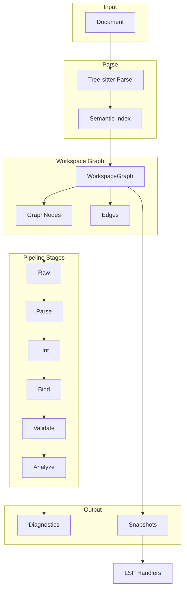

# Telescope V2 Architecture Guide

Telescope is the editor, CLI, and SDK experience layer for the shared OpenAPI toolchain. This document describes the V2 architecture around workspace orchestration, user-facing diagnostics, and protocol-independent core types.

## Overview

Telescope provides:

- **Linting** — Barrelman rules plus Navigator-backed structural diagnostics presented in CLI/LSP flows
- **Language Server** — Hover, completion, definition, references, rename, code actions, semantic tokens
- **CLI** — `lint`, `ci`, and `serve` subcommands for integration into CI/CD pipelines
- **SDK** — Programmatic access for tools that want Telescope's editor/CLI orchestration on top of Navigator + Barrelman

The V2 architecture centers on a **workspace graph** that models documents as nodes with directed edges for `$ref` relationships. Telescope uses Navigator's shared `raw -> parse -> bind` substrate and layers user-facing lint/validate/analyze workflows on top of that data.

## High-Level Architecture

**Data flow**: Document → Navigator index + graph substrate → Barrelman rules / Telescope orchestration → Diagnostics and editor features. The WorkspaceGraph maintains nodes, edges, and snapshots consumed by LSP handlers.

## Package Layout

| Package | Purpose |
|---------|---------|
| `core/types` | Protocol-independent types: `Diagnostic`, `Range`, `Position`, `Severity`, `DiagnosticTag` |
| `core/graph` | Workspace graph engine: `WorkspaceGraph`, `GraphNode`, `Edge`, `StageName`, `StageResult` |
| `core/graph` (source) | Document sources: `DocumentSource`, `FilesystemSource`, `SyntheticSource`, `LSPSource` |
| `core/graph` (pipeline) | Shared graph substrate and stage runner for `raw`, `parse`, and `bind` |
| `core/graph` (snapshot) | Immutable snapshots: `Snapshot`, `SnapshotManager`, `SnapshotNode` |
| `core/parser` | Semantic model: `SemanticNode`, `NodeKind`, YAML tree walking |
| `core/parser` (virtual) | Virtual documents: `VirtualDocument`, `VirtualDocumentManager`, `OffsetMapper` |
| `core/parser` (embedded) | Embedded content: `EmbeddedLanguageProvider`, `MarkdownProvider` |
| `core/classify` | File classification: `FileClassifier`, `FileClassification`, heuristic signals |
| `core/validate` | Telescope-owned auxiliary validation helpers and non-OpenAPI schema support |
| `core/analyze` | Cross-document analysis: `FindUnusedComponents`, `DetectBreakingChanges`, `BundlePreview` |
| `sdk` | Public Go API: `Workspace`, `Option`, `AnalysisResult`, plugin SDK |
| `lsp` | LSP server wiring, handlers, graph bridge |
| `lsp/adapt` | Type conversion: `core/types` ↔ `gossip/protocol` |
| `lsp/bun` | Bun sidecar for TypeScript/JavaScript custom rules and Spectral rulesets |
| `lsp/observe` | Observability: `GraphInfo`, `RulePerf`, `$/telescope/*` notifications |
| `rules` | Rule registry, `RuleBuilder`, `Reporter`, `Walker` |
| `rules/analyzers` | Barrelman-backed analyzer bridge plus built-in semantic rule registration |
| `rules/checks` | Syntactic checks (duplicate keys, ASCII, missing tokens) |
| `rules/testing` | Test harness: `rulestest.Run()` with exact diagnostic assertions |
| `spectral` | Spectral-compatible YAML rulesets (JSONPath + built-in functions) |
| `project` | Multi-file workspace: file discovery, dependency graph |
| `plugin` | Go plugin host via `hashicorp/go-plugin` |
| `openapi` | Compatibility layer around Navigator types used by existing Telescope surfaces |
| `config` | `.telescope.yaml` loading, ruleset merging |
| `extensions` | `x-*` vendor extension schema validation |
| `markdown` | Markdown parsing/validation in description fields |
| `validation` | Additional JSON Schema validation for non-OpenAPI files |

## Data Flow

### Document Lifecycle

1. **Open** — Document enters via `DocumentSource` (filesystem, LSP overlay, or synthetic). Added to `WorkspaceGraph` via `AddSource`.
2. **Classify** — `FileClassifier` uses heuristics (root key, fingerprint, extension, config override, graph membership) to determine if the file is OpenAPI and whether it is a root or fragment.
3. **Parse** — `RawStage` reads content from the source; `ParseStage` builds the Navigator-backed semantic index.
4. **Bind** — `$ref` resolution; edges materialized in the graph (`EdgeRef`, `EdgePathRef`, `EdgeExternal`).
5. **Lint / Validate / Analyze** — Higher-level Telescope workflows run on top of parsed/bound documents. Navigator owns parse-time issues; Barrelman owns rule execution; Telescope owns presentation and orchestration.
6. **Diagnostics** — Stored per-node; aggregated in `Snapshot` for LSP/CLI output.

### Invalidation

When a document changes, `Invalidate(uri)` marks all stages dirty for that URI and cascades to dependents (documents that reference it). Pipeline stages re-run only for dirty nodes; cached results are reused when `StageResult.Version` matches `GraphNode.Version`.

## Core Abstractions

### Protocol-Independent Types (`core/types`)

- **`Diagnostic`** — Range, severity, code, message, tags, related info, optional fix
- **`Range`** — Start/end `Position` (0-based line, character)
- **`Severity`** — Error, Warning, Info, Hint
- **`DiagnosticTag`** — Unnecessary, Deprecated

These types are used throughout the core engine. The `lsp/adapt` package converts to/from `gossip/protocol` types at the LSP boundary.

### Workspace Graph (`core/graph`)

- **`WorkspaceGraph`** — Thread-safe directed graph: nodes (documents), edges (`$ref` relationships), roots
- **`GraphNode`** — Per-document state: source, version, raw bytes, stage results, dirty flags, diagnostics
- **`Edge`** — Source/target URI + JSON pointers, `EdgeKind` (Ref, Component, External)
- **`ReadOnlyGraph`** — Interface for SDK consumers to query the graph without mutating

### Document Sources

| Source | Use Case |
|--------|----------|
| `FilesystemSource` | CLI, file watcher |
| `LSPSource` | LSP document overlays (gossip `document.Store`) |
| `SyntheticSource` | SDK, Cartographer — programmatic injection |

### Pipeline Stages

| Stage | Depends On | Purpose |
|-------|------------|---------|
| `StageRaw` | — | Read content from `DocumentSource` |
| `StageParse` | Raw | Tree-sitter parse, semantic index |
| `StageBind` | Parse | `$ref` resolution, edge materialization |
| `StageLint` | Bind (logical) | Downstream Barrelman + Telescope lint orchestration |
| `StageValidate` | Bind (logical) | Downstream validation presentation / compatibility workflows |
| `StageAnalyze` | Bind (logical) | Cross-document analysis such as unused components, breaking changes, and bundle views |

### Virtual Document System

Embedded content (e.g., Markdown in `description` fields) is extracted as **virtual documents** with synthetic URIs (`vdoc://parent#/paths/~1users/get/description`). `VirtualDocumentManager` maintains them; `OffsetMapper` translates positions between virtual and source. Used for hover/completion in embedded Markdown.

### File Classification

`FileClassifier` uses weighted signals:

- Config override (glob → isOpenAPI) — weight 1.0
- Graph membership (referenced by known OpenAPI) — weight 1.0
- Root key (`openapi:` / `swagger:`) — weight 0.95
- Root key fingerprint (info, paths, components, etc.) — weight 0.6
- File extension (.yaml, .yml, .json) — weight 0.1

Confidence is computed as weighted sum; `IsOpenAPI` requires root key or (content signal + confidence ≥ 0.30).

### SDK (`sdk`)

`Workspace` wraps the graph, pipeline, and snapshot manager:

- `New(opts...)` — Create workspace with options
- `AddSource(src)` — Add document source
- `Analyze(ctx)` — Run full pipeline, return `AnalysisResult`
- `AnalyzeURI(ctx, uri)` — Run pipeline for single document
- `Graph()` — Read-only graph access
- `Snapshot()` — Current immutable snapshot

## LSP Integration

### Graph Bridge

`GraphBridge` connects the core graph engine to LSP handlers:

- `OnDocumentOpen` — Add synthetic source, classify, set root
- `OnDocumentChange` — Update synthetic source content, invalidate
- `OnDocumentClose` — Remove from graph, clear virtual docs
- `SyncEdgesFromIndex` — Sync edges from OpenAPI index (bridges old `IndexCache`)
- `LookupDefinition`, `FindReferences` — Use edge index for `$ref` resolution
- `BuildSnapshot` — Build immutable snapshot for sync handlers

Sync handlers read from `CurrentSnapshot()`; async analysis builds the next snapshot.

### Adapt Layer

`lsp/adapt` converts between `core/types` and `gossip/protocol`:

- `DiagnosticToProtocol` / `DiagnosticFromProtocol`
- `RangeToProtocol` / `RangeFromProtocol`
- `PositionToProtocol` / `PositionFromProtocol`
- `SeverityToProtocol` / `SeverityFromProtocol`

## Observability

Custom LSP notifications:

| Notification | Payload | Purpose |
|--------------|---------|---------|
| `$/telescope/graphInfo` | `GraphInfo` | Node count, edge count, roots, dirty count, stage durations, memory, snapshot version |
| `$/telescope/rulePerf` | `RulePerf` | Per-rule timing and diagnostic counts |

`CollectGraphInfo` and `RulePerfTracker` build these payloads for debugging and performance tuning.

## Extension Points

| Extension | Description |
|-----------|-------------|
| **Go plugins** | Compiled binaries in `.telescope/plugins/`, RPC via `hashicorp/go-plugin`. Use `sdk.Rule()` and `sdk.NewPlugin()` to define rules. |
| **Spectral rulesets** | YAML files with JSONPath + built-in functions. No JS execution. Configure via `.telescope.yaml` `spectralRulesets` field. |
| **Bun sidecar** | TypeScript/JavaScript rules run in a Bun subprocess with health checks and crash recovery. IPC protocol in `lsp/bun/protocol.go`. |
| **Additional JSON Schema** | Non-OpenAPI schema validation handled by the Go validator via `additionalValidation.schemas`. |
