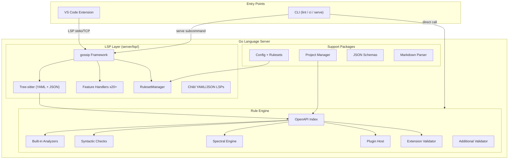

# Telescope Codebase Breakdown

## What is Telescope?

Telescope is an **OpenAPI linting and language-support tool** built on the Language Server Protocol (LSP). It ships as a VS Code extension, a standalone Go language server, and a CLI for CI pipelines. It supports Swagger 2.0 and OpenAPI 3.0.x through 3.2.x, with 88 built-in rules. Licensed MIT by SailPoint Technologies.

The codebase has three major components:

- **Go server** (`server/`) -- Primary implementation. Tree-sitter-based LSP server, CLI, and linting engine.
- **VS Code client** (`client/`) -- TypeScript VS Code extension.
- **Test fixtures** (`test-files/`) -- OpenAPI test files and examples.

```
telescope/
├── server/                    # Go language server + CLI (primary)
├── client/                    # VS Code extension client (TypeScript)
├── test-files/                # Test fixtures and examples
├── docs/                      # Documentation
├── specifications/            # OpenAPI spec references (2.0 – 3.2.0)
├── biome.json                 # TypeScript linting (Biome)
├── pnpm-workspace.yaml        # TypeScript workspace
└── package.json               # Root scripts
```

---

## Primary Use Cases

The codebase breaks into **8 distinct functional domains**.

---

### 1. VS Code Extension Client

**Package:** `client/src/`
**Purpose:** Bridge between VS Code and the Go language server.

| File | Responsibility |
|------|----------------|
| `extension.ts` | Extension activation, command registration, Go binary resolution |
| `session-manager.ts` | One `Session` per workspace folder, request routing |
| `session.ts` | Single LSP session lifecycle (start/stop server, trace config) |
| `workspace-scanner.ts` | Scans workspace for OpenAPI files, classifies them, sends list to server |
| `classifier.ts` | Heuristic detection of OpenAPI documents |
| `syntaxes/` | TextMate grammars for `openapi-yaml` and `openapi-json` |

**Responsibilities:**

- File discovery and classification
- Session lifecycle management (one LSP server per workspace folder)
- Go binary resolution (env var, VS Code setting, PATH, bundled)
- Custom protocol messages (`telescope/setOpenAPIFiles`, `telescope/didChangeOpenApiFiles`)
- Format conversion commands (YAML to JSON, JSON to YAML)
- Refactor commands (sort tags, sort paths, generate response skeletons)

---

### 2. Go LSP Server

**Package:** `server/lsp/`
**Purpose:** gossip-based LSP server with 20+ feature handlers.

| File | Responsibility |
|------|----------------|
| `server.go` | Entry point: creates gossip server, registers tree-sitter, wires analyzers |
| `ruleset_manager.go` | Config + ruleset merging, severity filtering, hot-reload |
| `childlsp.go` | Spawns child YAML/JSON LSPs for syntax validation |
| `hover.go` | `$ref` preview on hover |
| `completion.go` | `$ref` paths, status codes, media types, tags |
| `definition.go` | Go to `$ref` targets, operationId definitions |
| `references.go` | Find all usages of components |
| `code_actions.go` | Quick fixes for common issues |
| `code_lens.go` | Reference counts, response summaries |
| `inlay_hints.go` | Type hints, required markers |
| `rename.go` | Rename operationIds and components across files |
| `symbols.go` | Document and workspace symbols |
| `semantic_tokens.go` | OpenAPI-specific syntax highlighting |
| `document_links.go` | Clickable `$ref` links |
| `call_hierarchy.go` | Component reference relationships |
| `diagnostics_view_test.go` | Diagnostic view tests |
| `folding_ranges.go` | Code folding |

**Key wiring in `server.go`:**

- Registers tree-sitter parsers for YAML and JSON
- Sets `UserDataProvider` to build `openapi.Index` on-demand per document
- Registers 6 analyzer types: checks, analyzers, spectral, plugins, extensions, additional validation
- Sets up `RulesetManager` as `DiagnosticTransformer` for severity filtering
- Registers file watchers for ruleset hot-reload

---

### 3. OpenAPI Parsing & Indexing

**Package:** `server/openapi/`
**Purpose:** Build a typed OpenAPI model from tree-sitter parse trees.

| File | Responsibility |
|------|----------------|
| `parser.go` | Walks tree-sitter tree → typed `Document` model (1100+ lines) |
| `model.go` | Complete type model: `Document`, `Operation`, `Schema`, `Parameter`, etc. |
| `index.go` | `BuildIndex()` for fast lookups + `IndexCache` (thread-safe) |
| `version.go` | OpenAPI version detection (2.0, 3.0, 3.1, 3.2) |
| `classifier.go` | Document type detection (root, fragment, unknown) |
| `fragment.go` | Fragment validation for individual constructs |
| `resolver.go` | Local `$ref` resolution |
| `queries.go` | Tree-sitter queries |

**Key design:**

- All constructs track source locations via `openapi.Loc`
- `DescriptionValue` preserves markdown text with geometry for LSP positioning
- `IndexCache` uses `sync.RWMutex` for concurrent access
- Parser handles both YAML and JSON tree-sitter grammars

---

### 4. Rule System

**Package:** `server/rules/`
**Purpose:** Rule registry, fluent builder API, and execution engine.

| File | Responsibility |
|------|----------------|
| `builder.go` | Fluent API: `Define(id, meta).Operations(fn).Schemas(fn)...` |
| `reporter.go` | Diagnostic reporting with chainable enrichment (`WithTags`, `WithRelated`) |
| `walker.go` | OpenAPI model traversal for rule execution |
| `validators.go` | Composable validators: `Required`, `KebabCase`, `TitleCase`, `Pattern`, etc. |
| `registry.go` | Global rule registry with categories |
| `index.go` | `AnalysisData`, `GetIndex()`, `CrossRefResolver` interface |
| `cli.go` | `CollectAll()` and `RunAnalyzers()` for CLI mode |

**Rule categories:** Naming, Documentation, Structure, Types, Security, Servers, Paths, References, Syntax, OWASP.

**Built-in analyzers** (`rules/analyzers/`):

| File | Rules |
|------|-------|
| `structural.go` | JSON Schema validation against OpenAPI schemas |
| `naming.go` | Schema naming, operationId format, path casing |
| `documentation.go` | Missing descriptions, summaries, examples |
| `security.go` | Security requirements, API key placement |
| `owasp.go` | OWASP API security rules |
| ... | Additional category-specific analyzers |

**Built-in checks** (`rules/checks/`):

| File | Rules |
|------|-------|
| `register.go` | Duplicate key detection, syntax errors |
| `ascii.go` | Non-ASCII character detection |

**Test harness** (`rules/testing/`):

```go
rulestest.Run(t, analyzer, rulestest.Case{
    Name: "test name",
    Spec: `openapi: "3.1.0" ...`,
    Expect: []rulestest.Diag{
        {Line: 7, Code: "rule-id", Severity: rulestest.Warn},
    },
})
```

---

### 5. Plugin System

**Package:** `server/plugin/` + `server/sdk/`
**Purpose:** External Go plugin binaries communicate via `hashicorp/go-plugin` RPC.

| File | Responsibility |
|------|----------------|
| `plugin/host.go` | Plugin discovery from `.telescope/plugins/`, subprocess launch |
| `plugin/protocol.go` | RPC handshake and `RulePlugin` interface |
| `plugin/manager.go` | Plugin lifecycle management |
| `plugin/yaml_rules.go` | YAML ruleset adapter for plugin interface |
| `sdk/plugin.go` | Plugin instance and RPC server for rule authors |
| `sdk/rule.go` | Plugin-scoped fluent rule builder |
| `sdk/types.go` | Type aliases and severity/category constants |

**Plugin workflow:**

1. Telescope discovers executables in `.telescope/plugins/`
2. Each plugin is launched as a subprocess
3. Host calls `GetMeta()` to discover rules
4. On document changes, host calls `Analyze()` with raw content
5. Plugin returns diagnostics; host merges results

---

### 6. Spectral Rule Engine

**Package:** `server/spectral/`
**Purpose:** Evaluate Spectral-compatible YAML rulesets (JSONPath + built-in functions).

| File | Responsibility |
|------|----------------|
| `engine.go` | Rule evaluation engine, implements `treesitter.Analyzer` |
| `functions.go` | Built-in rule functions (schema, pattern, enum, etc.) |
| `jsonpath.go` | JSONPath expression evaluation |
| `types.go` | `Rule`, `RuleFunction`, `RuleOperator` types |

**Key design:** No JavaScript execution. Rules are evaluated using JSONPath against `yaml.Node` trees with built-in Go functions.

---

### 7. Configuration & Rulesets

**Config:** `server/config/`
**Rulesets:** `server/rulesets/`

| File | Responsibility |
|------|----------------|
| `config/config.go` | `.telescope.yaml` structure and loading |
| `config/loader.go` | File discovery and parsing |
| `config/spectral.go` | Spectral config compatibility |
| `rulesets/model.go` | Ruleset model with Spectral-compatible severity parsing |
| `rulesets/resolver.go` | `extends` chain resolution |
| `rulesets/merge.go` | Ruleset merging (later wins) |
| `rulesets/builtin.go` | Built-in Telescope rulesets |
| `rulesets/spectral_oas.go` | Built-in Spectral OAS ruleset |

**Config resolution order:**

1. `extends` specifies base ruleset (`telescope:recommended`, etc.)
2. Spectral YAML rulesets from `plugins` field are merged
3. `rules` section overrides individual severities
4. `RulesetManager` computes final enabled rules

---

### 8. CLI

**Package:** `server/cli/`
**Purpose:** Command-line interface for linting and CI integration.

| File | Responsibility |
|------|----------------|
| `root.go` | Cobra root command, global flags |
| `lint.go` | `telescope lint` -- validate files, output diagnostics |
| `ci.go` | `telescope ci` -- diff-aware linting, PR comments |
| `serve.go` | `telescope serve` -- start LSP server (stdio, TCP, Unix) |
| `output.go` | Output formatting (text, JSON, SARIF, GitHub annotations) |
| `report.go` | Markdown and JSON report generation |
| `github.go` | GitHub API client for PR comments |

---

## Architecture Diagram



---

## Key Data Types (Go)

| Type | Package | Role |
|------|---------|------|
| `openapi.Document` | `openapi/model.go` | Complete parsed OpenAPI document with locations |
| `openapi.Index` | `openapi/index.go` | Fast lookups by operation ID, path, component |
| `openapi.Loc` | `openapi/model.go` | Source location (start/end line/column) |
| `openapi.IndexCache` | `openapi/index.go` | Thread-safe per-document index cache |
| `rules.RuleBuilder` | `rules/builder.go` | Fluent API for defining rules |
| `rules.RuleMeta` | `rules/registry.go` | Rule metadata (ID, description, severity, category) |
| `rules.Reporter` | `rules/reporter.go` | Diagnostic reporting with enrichment |
| `rules.AnalysisData` | `rules/index.go` | Per-document index + optional cross-file resolver |
| `config.Config` | `config/config.go` | Parsed `.telescope.yaml` |
| `rulesets.RuleSet` | `rulesets/model.go` | Ruleset with extends, rules, severity overrides |
| `spectral.Rule` | `spectral/types.go` | Spectral rule: JSONPath + functions |
| `plugin.RunningPlugin` | `plugin/host.go` | Tracked plugin subprocess |

---

## Key Dependencies

| Package | Purpose |
|---------|---------|
| [gossip](https://github.com/LukasParke/gossip) | LSP framework with tree-sitter integration |
| [go-tree-sitter](https://github.com/tree-sitter/go-tree-sitter) | Incremental YAML/JSON parsing |
| [hashicorp/go-plugin](https://github.com/hashicorp/go-plugin) | Process-isolated plugin binaries via RPC |
| [yuin/goldmark](https://github.com/yuin/goldmark) | Markdown parsing in descriptions |
| [vmware-labs/yaml-jsonpath](https://github.com/vmware-labs/yaml-jsonpath) | JSONPath for Spectral rules |
| [spf13/cobra](https://github.com/spf13/cobra) | CLI framework |

---

## Cross-Cutting Concerns

### Concurrency

- `IndexCache` uses `sync.RWMutex` for thread-safe document caching
- Plugin host runs multiple plugins concurrently; results are merged
- LSP diagnostics are debounced (configurable, default 300ms)
- Child LSP servers run as separate processes

### Error Handling

- LSP handlers use `defer/recover` patterns via gossip framework
- Plugin crashes are isolated (subprocess model)
- Configuration errors are reported as LSP notifications

### Logging

- Uses `log/slog` throughout the Go server
- VS Code trace setting: `telescope.trace` controls LSP logging verbosity

### External Integrations

- **GitHub API** (`cli/github.go`): PR comment posting via REST API
- **Child YAML/JSON LSPs**: Spawned for syntax-level validation
- **gossip**: LSP connection over stdio or TCP
