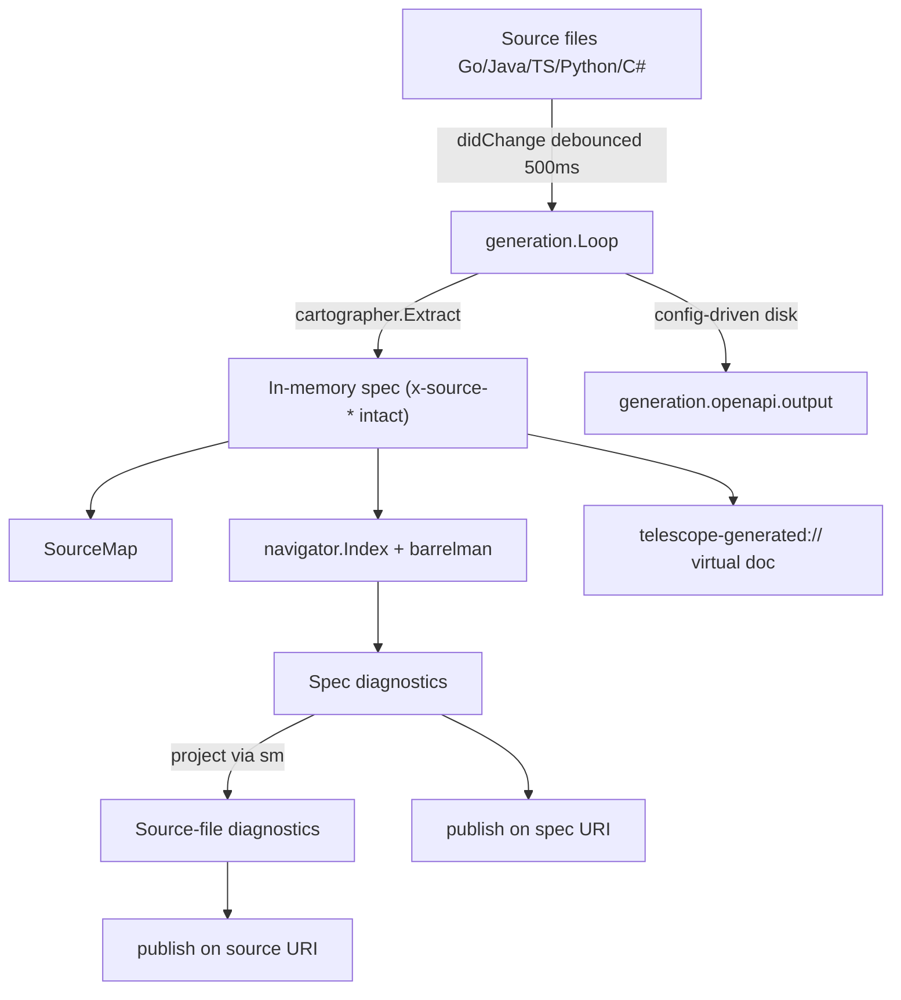

# Telescope OpenAPI generation loop

Telescope treats cartographer as a first-class LSP-side generation loop:
source files are watched, extraction runs in-process, and the resulting spec
is cached in memory alongside a SourceMap that lets diagnostics be
reverse-projected onto the Go / Java / TS code that produced them.

## Architecture



## Lifecycle

Loop construction is cheap (no I/O). `Start` runs only after the LSP
`initialized` notification so the editor is unblocked. `Stop` drains a
bounded window before cancelling.

- `initialize` -> construct `generation.Manager` in `NewServer`
- `initialized` -> `manager.Add(...)` per workspace root + first extraction
  on a goroutine
- `textDocument/didChange` on a Go/Java/TS file -> debounced regenerate
- `textDocument/didSave` -> forced regenerate + `writeMode: onSave` disk write
- `workspace/didChangeWorkspaceFolders` -> `Manager.Add`/`Remove` per folder
- `workspace/didChangeConfiguration` -> `Manager.Apply` (safe fields hot-
  reload; unsafe fields trigger Stop+Start internally)
- `shutdown` -> `manager.StopAll(500ms)` in the NewServer cleanup func

## Configuration

```yaml
generation:
  openapi:
    enabled: true
    root: "."

    # Trigger shape for the in-memory loop
    triggerMode: always      # always | save
    debounceMs: 500

    # Disk materialization (strictly config-driven)
    output: "openapi.yaml"
    writeMode: onSave        # never | onDemand | onSave | always
    writeSourceMap: false

    # Extension surfaces
    showCodeLens: true
    showTreeView: true

    cartographer:
      config:
        lang: go
        title: My API
        template: go-web
      extraction:
        errorSchema: legacy-error-response
        signaturePaginationTypes: []
        mergeCoLocatedOpenAPI: false
```

### Write mode matrix

| writeMode  | in-memory | disk on save | disk on edit | disk on command |
|------------|-----------|--------------|--------------|-----------------|
| `never`    | yes       | no           | no           | no              |
| `onDemand` | yes       | no           | no           | yes             |
| `onSave`   | yes       | yes          | no           | yes             |
| `always`   | yes       | yes          | yes          | yes             |

All modes keep an in-memory copy available to navigator, barrelman, hover,
code actions, and the `telescope-generated://` virtual URI.

`generation.openapi.cartographer.extraction` maps to cartographer's
`extractionopts.Options` and merges with `.cartographer/cartographer.yaml`
when present. Supported templates: `go-web`, `java-spring`,
`typescript-node`, `python-fastapi`, `csharp-web`.

The validator rejects silent no-op combinations: `writeSourceMap: true`
without `output`, `writeMode: onSave` without `output`, unknown trigger/
writeMode values, and negative `debounceMs`.

## Reverse projection

Every cartographer-extracted operation, schema, and field carries
`x-source-file`, `x-source-line`, and `x-source-column`. The
`cartographer/sourcemap` package reads these back; the Telescope projection
layer then translates a diagnostic's JSON pointer into the originating source
location.

Example: a `sailpoint-parameter-description` diagnostic on
`/paths/~1v1~1users/post/parameters/0/description` is resolved to
`UserController.java:42` and re-published on that source URI, with
`Data.ProjectedFrom = "telescope/generated"` so clients can distinguish
projected diagnostics from hand-authored ones. The VS Code extension renders
projected diagnostics with a `[generated]` prefix in the Problems pane.

## CLI

```bash
telescope generate --root ./my-service --lang go --output openapi.yaml
telescope generate --root ./my-service --watch
telescope generate --dry-run   # print to stdout
```

## LSP commands

Every generation command is registered via `ExecuteCommandProvider`:

- `telescope.regenerate(root?)`
- `telescope.writeSpecNow(root?)`
- `telescope.openGeneratedSpec(root?)`
- `telescope.openSourceForSpec(specURI, pointer)`
- `telescope.getGeneratedSpecBytes(root?)`
- `telescope.getGeneratedSpecTree(root?)`
- `telescope.getSourceContributions(sourceURI)`
- `telescope.getSourceMapForFile(sourceURI)`

The `$/telescope.generation` notification delivers `{state, root, durationMs,
operations, types, error}` on every `GenerationStarted`,
`GenerationSucceeded`, and `GenerationFailed` event.

## Extension surfaces

The VS Code / Cursor extension consumes the commands and notifications above
to render:

- a status-bar entry (`Telescope: spec up to date / regenerating / failed`)
- an activity-bar container with Generated Spec, Source Contributions, and
  Generation Diagnostics tree views
- a readonly `telescope-generated://` virtual document
- inline CodeLenses on Go / Java / TS / Python / C# source declarations
- palette commands for Regenerate Spec, Open Generated Spec, Write Spec to
  Disk Now, and Show SourceMap
