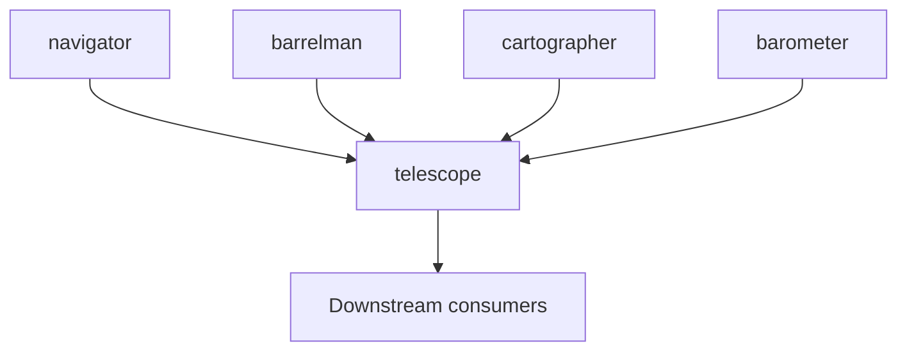

# Toolchain Guide

Telescope is one repo in a six-repo OpenAPI toolchain. This document captures the **minimum Telescope-side contract** for coordinating with sibling repositories. Full release-train documentation may live in Navigator when you develop across repos locally.

## Six-repo map

| Repository | Role in Telescope |
|------------|-------------------|
| [tree-sitter-openapi](https://github.com/sailpoint-oss/tree-sitter-openapi) | OpenAPI tree-sitter grammar and bindings |
| [navigator](https://github.com/sailpoint-oss/navigator) | Parse, index, `$ref` resolution, structural/schema validation |
| [barrelman](https://github.com/sailpoint-oss/barrelman) | Generic OAS/OWASP lint rules and `RegisterPlugin` surface |
| [cartographer](https://github.com/sailpoint-oss/cartographer) | Source-to-OpenAPI extraction (wrapped by `server/generation/`) |
| [barometer](https://github.com/sailpoint-oss/barometer) | Live HTTP contract tests and Arazzo runner |
| **telescope** (this repo) | VS Code extension, LSP, CLI, GitHub Action, SDK |

Telescope also depends on [gossip](https://github.com/LukasParke/gossip) for the LSP framework. Gossip is not part of the SailPoint OSS toolchain but is required for local builds (see below).

## Pinned versions

Current dependency versions in [server/go.mod](../server/go.mod):

| Module | Version (current) |
|--------|-------------------|
| `github.com/sailpoint-oss/navigator` | v0.13.0 |
| `github.com/sailpoint-oss/barrelman` | v0.9.0 |
| `github.com/sailpoint-oss/cartographer` | v0.8.0 |
| `github.com/sailpoint-oss/barometer` | v0.4.0 |
| `github.com/sailpoint-oss/tree-sitter-openapi` | v0.1.0 |
| `github.com/LukasParke/gossip` | v0.1.12 |

Check `server/go.mod` for the authoritative pins at any given commit.

## Dependency direction



Rules:

1. **Navigator and Barrelman changes land first** when parse/index/diagnostic contracts move.
2. **Telescope bumps** `server/go.mod`, runs full tests and E2E, then publishes.
3. **Downstream tooling** (custom CI wrappers, branded rule packs) follows after Telescope when compatibility surfaces change.

Cartographer and Barometer bumps follow the same pattern when generation or contract-test APIs change.

## Local multi-repo development

### Gossip (optional local development)

Normal builds use the pinned gossip version from the Go module proxy (`server/go.mod`). To develop against a local gossip checkout:

```bash
# From parent directory that will contain both repos
git clone https://github.com/LukasParke/gossip.git
git clone https://github.com/sailpoint-oss/telescope.git
cd telescope
cp go.work.example go.work   # gitignored; replace => ../gossip from repo root
```

The replace directive lives in `go.work`, not in `server/go.mod`.

### Full toolchain workspace

When developing across Navigator, Barrelman, and siblings:

```bash
# From parent directory containing all repos
go work init ./navigator ./barrelman ./telescope/server ./barometer
go work sync
```

See [AGENTS.md](../AGENTS.md) and [README.md](../README.md) Development section for the canonical `go work` pattern.

## Bump checklist

When updating navigator, barrelman, cartographer, or barometer:

1. Edit version pins in [server/go.mod](../server/go.mod)
2. Run `cd server && go mod tidy` if imports changed
3. Run `go test -race ./... -timeout 10m` in `server/`
4. Run relevant E2E from the repo root:
   ```bash
   pnpm --filter ./client test:e2e:compile
   pnpm --filter ./client test:e2e:run:single
   ```
   Add multi-root and sidecar runs when changes touch workspace isolation or Bun sidecar behavior.
5. If sibling Navigator checkout is available, check `../navigator/TOOLCHAIN_FIXTURE_MATRIX.md` for cross-repo parity anchors
6. For coordinated release trains, see Navigator's `TOOLCHAIN_BOUNDARIES.md` for bump order
7. Note the bump in [CHANGELOG.md](../CHANGELOG.md)

Before publishing a compatibility-sensitive release, also follow [PUBLISHING.md](PUBLISHING.md) § Toolchain Compatibility.

## What Telescope wraps vs imports directly

| Upstream | Telescope integration | Boundary |
|----------|----------------------|----------|
| Navigator | `server/openapi/`, `server/core/graph/`, `server/bridge/`, `server/project/` | Do not reimplement parse/validate |
| Barrelman | `server/bridge/`, `server/rules/analyzers/register.go` | Generic rules live upstream; branded rules via plug-in in downstream consumers |
| Cartographer | `server/generation/` only | Do not import `cartographer/extract/*` beyond `extract/extractionopts` |
| Barometer | `server/contractrunner/` | Contract test orchestration only |

Full ownership boundaries: [REPO-BOUNDARIES.md](REPO-BOUNDARIES.md).

## Lint rule policy

Telescope ships **vendor-neutral generic rules** only. Branded rule packs register in downstream consumers:

```go
import _ "private-consumer/lintrules/yourbrand" // init() calls barrelman.RegisterPlugin
```

Telescope's `RegisterAll` in `server/rules/analyzers/register.go` calls `barrelman.ApplyPlugins` after loading generic analyzers.

## External release-train docs

When all sibling repos are checked out locally, these Navigator documents hold cross-repo release coordination detail:

- `../navigator/TOOLCHAIN_BOUNDARIES.md` — bump order
- `../navigator/TOOLCHAIN_FIXTURE_MATRIX.md` — parity anchors for smoke tests

If you only have the Telescope checkout, the bump checklist above is sufficient for most dependency updates.

## See also

- [MAINTAINER-GUIDE.md](MAINTAINER-GUIDE.md) — maintainer onboarding
- [PUBLISHING.md](PUBLISHING.md) — release workflows
- [REPO-BOUNDARIES.md](REPO-BOUNDARIES.md) — scope boundaries
