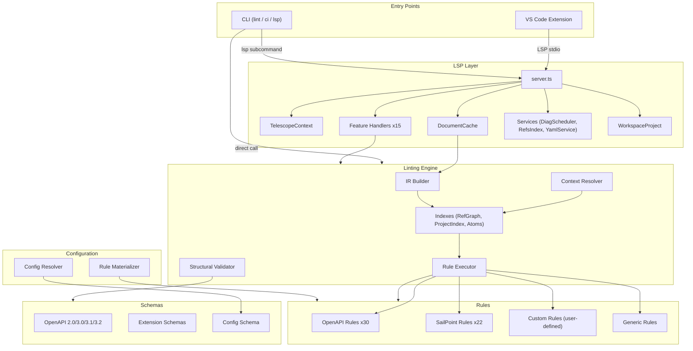
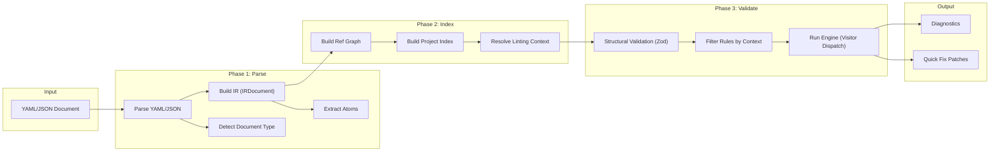
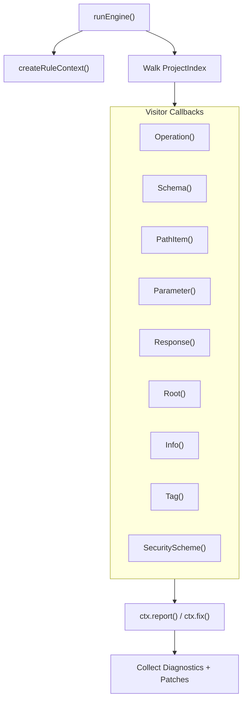
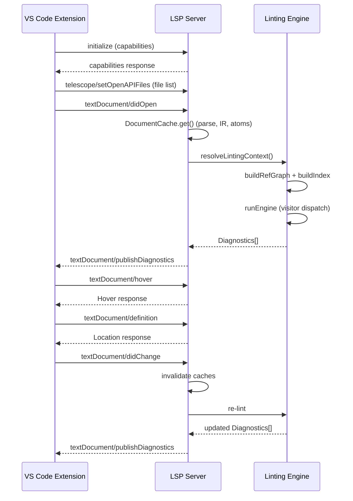
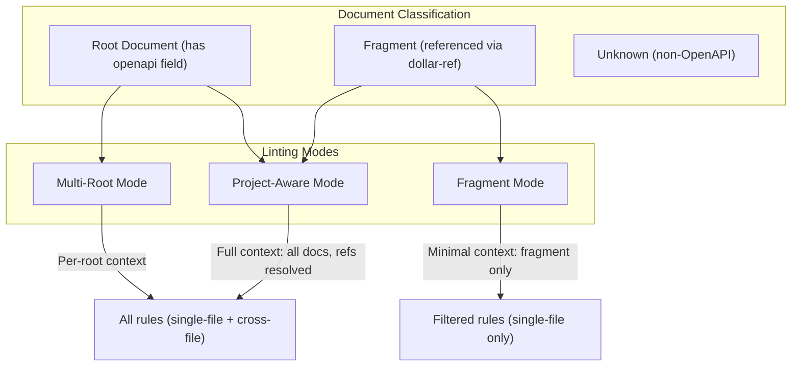
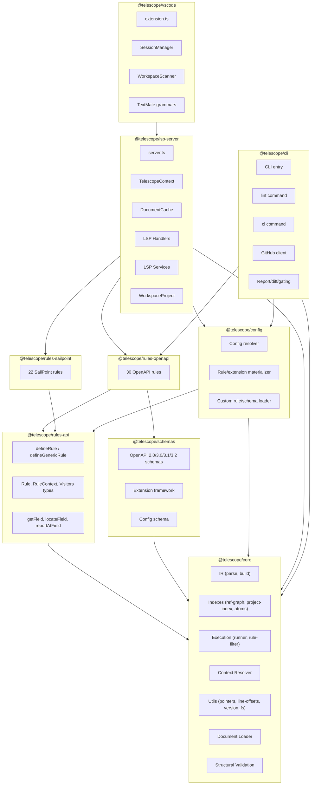
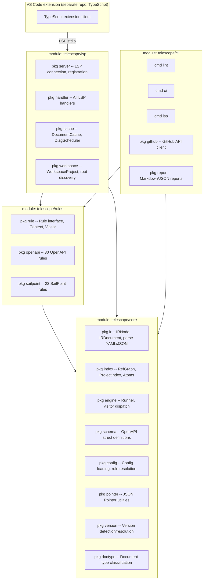
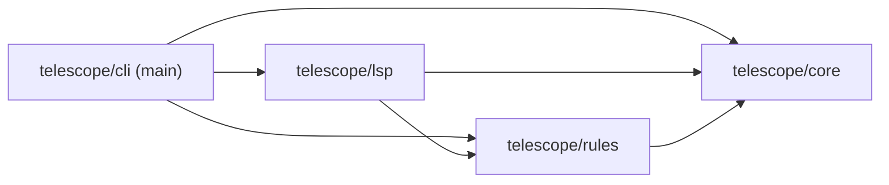

# Telescope Codebase Breakdown

## What is Telescope?

Telescope is an **OpenAPI linting and language-support tool** built on the Language Server Protocol (LSP). It ships as a VS Code extension, a standalone language server, and a CLI for CI pipelines. It supports Swagger 2.0 and OpenAPI 3.0.x through 3.2.x, with 30+ generic OpenAPI rules and 22 SailPoint-specific rules. Licensed MIT by SailPoint Technologies.

The codebase is a **TypeScript pnpm monorepo** (`packages/*`) with 3 workspace packages: `telescope-client`, `telescope-server`, and `test-files`.

```
telescope/
├── packages/
│   ├── telescope-client/        # VS Code extension client
│   ├── telescope-server/        # Language server + linting engine
│   └── test-files/              # Test fixtures and examples
├── docs/                        # Documentation
├── specifications/              # OpenAPI spec references (2.0 – 3.2.0)
├── biome.json                   # Linting and formatting (Biome)
├── pnpm-workspace.yaml          # Monorepo workspace definition
└── package.json                 # Root scripts and workspace config
```

---

## Primary Use Cases

The codebase breaks into **7 distinct functional domains**. Each section below describes one domain, its purpose, key files, and responsibilities.

---

### 1. VS Code Extension Client

**Package:** `packages/telescope-client/src/`
**Purpose:** Bridge between VS Code and the language server.

| File                   | Responsibility                                                           |
| ---------------------- | ------------------------------------------------------------------------ |
| `extension.ts`         | Extension activation, command registration, test API                     |
| `session-manager.ts`   | One `Session` per workspace folder, request routing                      |
| `session.ts`           | Single LSP session lifecycle (start/stop server, trace config)           |
| `workspace-scanner.ts` | Scans workspace for OpenAPI files, classifies them, sends list to server |
| `classifier.ts`        | Heuristic detection of OpenAPI documents                                 |
| `syntaxes/`            | TextMate grammars for `openapi-yaml` and `openapi-json`                  |

**Responsibilities:**

- File discovery and classification
- Session lifecycle management (one LSP server per workspace folder)
- Custom protocol messages (`telescope/setOpenAPIFiles`, `telescope/didChangeOpenApiFiles`)
- Format conversion commands (YAML to JSON, JSON to YAML)
- Refactor commands (sort tags, sort paths, generate response skeletons)

---

### 2. LSP Server and Handlers

**Package:** `packages/telescope-server/src/server.ts` + `src/lsp/`
**Purpose:** LSP connection, handler registration, document lifecycle management.

| File / Directory                     | Responsibility                                                                                       |
| ------------------------------------ | ---------------------------------------------------------------------------------------------------- |
| `server.ts`                          | Entry point: creates LSP connection, registers all handlers                                          |
| `lsp/context.ts`                     | `TelescopeContext`: workspace config, rule loading, OpenAPI file tracking, root tracking             |
| `lsp/document-cache.ts`              | `DocumentCache`: parses YAML/JSON, builds IR, extracts atoms, caches `CachedDocument`                |
| `lsp/handlers/`                      | 15+ handlers (see table below)                                                                       |
| `lsp/services/`                      | `DiagnosticsScheduler`, `ReferencesIndex`, `DocumentProvider`, `YamlService`, position/schema caches |
| `lsp/workspace/workspace-project.ts` | `WorkspaceProject`: workspace state, root discovery, overlay FS                                      |

**LSP Feature Handlers:**

| Handler                  | Features Provided                                 |
| ------------------------ | ------------------------------------------------- |
| `diagnostics.ts`         | Pull-based and workspace diagnostics              |
| `navigation.ts`          | Go to definition, find references, call hierarchy |
| `hover.ts`               | `$ref` preview on hover                           |
| `completions.ts`         | `$ref` paths, status codes, media types, tags     |
| `code-actions.ts`        | Quick fixes for common issues                     |
| `code-lens.ts`           | Reference counts, response summaries              |
| `inlay-hints.ts`         | Type hints, required markers                      |
| `rename.ts`              | Rename `operationId` and components across files  |
| `symbols.ts`             | Document and workspace symbols                    |
| `semantic-tokens.ts`     | OpenAPI-specific syntax highlighting              |
| `document-links.ts`      | Clickable `$ref` links                            |
| `document-highlights.ts` | Highlight refs at cursor                          |
| `execute-commands.ts`    | Sort tags, sort paths, generate responses         |
| `formatting.ts`          | Delegates to yaml-language-server                 |
| `folding-ranges.ts`      | Delegates to yaml-language-server                 |
| `selection-ranges.ts`    | Delegates to yaml-language-server                 |
| `linked-editing.ts`      | Linked editing ranges                             |

---

### 3. Linting Engine Core

**Package:** `packages/telescope-server/src/engine/`
**Purpose:** Format-agnostic OpenAPI linting pipeline: parse, index, execute rules, produce diagnostics.

| Sub-module     | Directory            | Responsibility                                                                                                                                                                                        |
| -------------- | -------------------- | ----------------------------------------------------------------------------------------------------------------------------------------------------------------------------------------------------- |
| **IR**         | `engine/ir/`         | `buildIRFromYaml`, `buildIRFromJson` -- format-neutral AST (`IRNode`, `IRDocument`) with source locations (`Loc`)                                                                                     |
| **Indexes**    | `engine/indexes/`    | `buildRefGraph` (ref graph with cycle detection), `buildIndex` (ProjectIndex: operations, schemas, components, paths), `extractAtoms` (lightweight atom extraction), `OperationIdIndex`, `GraphIndex` |
| **Execution**  | `engine/execution/`  | `runEngine` (visitor dispatch), `filterRulesByContext` (single-file vs cross-file), `runGenericRules` (non-OpenAPI)                                                                                   |
| **Context**    | `engine/context/`    | `resolveLintingContext` (project-aware / fragment / multi-root), `DocumentTypeCache`, `ProjectContextCache`, `discoverWorkspaceRoots`, `buildProjectContextForRoot`                                   |
| **Validation** | `engine/validation/` | `validateProjectStructure` (Zod structural validation against OpenAPI schemas)                                                                                                                        |
| **Utils**      | `engine/utils/`      | Pointer math, line offsets, document type detection, version detection/resolution, file system abstraction (`FileSystem`, `MemoryFileSystem`, `NodeFileSystem`), hashing, logging                     |

---

### 4. Rule System

**Package:** `packages/telescope-server/src/engine/rules/`
**Purpose:** Rule API and built-in rules using a visitor pattern.

**Rule API:**

| File                     | Exports                                                                        |
| ------------------------ | ------------------------------------------------------------------------------ |
| `rules/api.ts`           | `defineRule`, `getField`, `locateField`, `reportAtField`                       |
| `rules/types.ts`         | `Rule`, `RuleContext`, `Visitors`, `Diagnostic`, `FilePatch`, `ProjectContext` |
| `rules/generic-types.ts` | `defineGenericRule`, `GenericRule`, `GenericVisitors` (for non-OpenAPI files)  |

**OpenAPI Rules** (`rules/openapi/`) -- 30 rules across 8 categories:

| Category          | Rules                                                                                                                                                                  |
| ----------------- | ---------------------------------------------------------------------------------------------------------------------------------------------------------------------- |
| **references**    | `unresolved-ref`                                                                                                                                                       |
| **naming**        | `schema-name-capital`, `example-name-capital`, `operationid-unique`, `tags-format`                                                                                     |
| **documentation** | `deprecated-description`, `enum-description`                                                                                                                           |
| **structure**     | `additional-properties`, `allof-mixed-types`, `allof-structure`, `array-items`, `discriminator-mapping`, `request-body-content`, `type-required`                       |
| **types**         | `no-unknown-formats`                                                                                                                                                   |
| **security**      | `no-api-key-in-query`, `oauth-flow-urls`, `security-global-or-operation`, `security-schemes-defined`                                                                   |
| **servers**       | `servers-defined`, `server-url-https`                                                                                                                                  |
| **paths**         | `kebab-case`, `no-trailing-slash`, `no-http-verbs`, `params-match`, `template-valid`, `id-unique-in-path`, `casing-consistency`, `path-param-values-no-generic-syntax` |
| **document**      | `ascii`                                                                                                                                                                |

**SailPoint Rules** (`rules/sailpoint/`) -- 22 rules across 5 categories:

| Category       | Rules                                                                                                                                             |
| -------------- | ------------------------------------------------------------------------------------------------------------------------------------------------- |
| **operations** | `description-required`, `error-responses`, `id-format`, `pagination`, `security-requirements`, `summary-required`, `tags-required`, `user-levels` |
| **parameters** | `description-required`, `example-keys`, `example-required`, `filters`, `required-explicit`, `sorters`                                             |
| **schemas**    | `description-required`, `example-keys`, `example-required`, `required-array`                                                                      |
| **types**      | `boolean-default`, `numeric-format`                                                                                                               |
| **root**       | `sailpoint-api`, `tags`                                                                                                                           |

---

### 5. OpenAPI Schema Definitions

**Package:** `packages/telescope-server/src/engine/schemas/`
**Purpose:** Zod-based schemas for structural validation of OpenAPI 2.0, 3.0, 3.1, 3.2.

| Component                | Files                                                                                                                                    |
| ------------------------ | ---------------------------------------------------------------------------------------------------------------------------------------- |
| Version-specific modules | `openapi-2.0-module.ts`, `openapi-3.0-module.ts`, `openapi-3.1-module.ts`, `openapi-3.2-module.ts`                                       |
| Shared base              | `openapi-base.ts` (Contact, License, Reference, etc.)                                                                                    |
| Per-version structures   | `3.x/` subdirectories: info, paths, operation, parameter, schema, request-body, response, security-scheme, server, components, callbacks |
| Data type schemas        | `3.x/data-types/`: base, object, array, string, number, integer, boolean, null                                                           |
| Extension schemas        | `extensions/`: framework for vendor extensions (`x-redocly`, `x-scalar`, `x-speakeasy`, `x-stoplight`)                                   |
| JSON Schema support      | `jsonschema-2020-12.ts`                                                                                                                  |
| Config schema            | `config-schema.ts` (validates `.telescope/config.yaml`)                                                                                  |

---

### 6. Configuration System

**Package:** `packages/telescope-server/src/engine/config/`
**Purpose:** Load and resolve `.telescope/config.yaml`, materialize rules and extensions.

| File                 | Exports                                                         |
| -------------------- | --------------------------------------------------------------- |
| `config/resolver.ts` | `resolveConfig`, `loadCustomOpenAPIRule`, `loadCustomExtension` |
| `config/index.ts`    | `materializeRules`, `materializeExtensions`, `defaultConfig`    |

**Supports:**

- Custom OpenAPI rules (`.ts`/`.js` via dynamic `import()`)
- Custom generic rules for non-OpenAPI files
- Custom schemas (Zod and JSON Schema)
- Pattern-based file matching (globs)
- Severity overrides per rule
- Extension configuration for vendor-specific fields

---

### 7. CLI

**Package:** `packages/telescope-server/src/cli/`
**Purpose:** CI/CD integration for headless linting and GitHub PR commenting.

| File            | Responsibility                                                                                                |
| --------------- | ------------------------------------------------------------------------------------------------------------- |
| `cli/index.ts`  | Entry point, subcommand dispatch (manual arg parsing)                                                         |
| `cli/lint.ts`   | `runLintCommand`: validate OpenAPI files, output formats (`json`, `github`), report generation (`md`, `json`) |
| `cli/ci.ts`     | `runCiCommand`: CI mode with diff-aware linting, PR comments                                                  |
| `cli/lsp.ts`    | `runLspCommand`: start LSP server via stdio                                                                   |
| `cli/github.ts` | `GitHubClient`: PR comment/review posting via GitHub REST API (only external HTTP in the codebase)            |
| `cli/report.ts` | Report formatting (Markdown, JSON)                                                                            |
| `cli/diff.ts`   | Diff computation between revisions                                                                            |
| `cli/gating.ts` | Quality gating logic (pass/fail)                                                                              |

**CLI Subcommands:**

| Subcommand | Flags                                                                                          | Purpose                               |
| ---------- | ---------------------------------------------------------------------------------------------- | ------------------------------------- |
| `lint`     | `--workspace`, `--format`, `--root`, `--report-md`, `--report-json`, `--summary`               | Validate OpenAPI files                |
| `ci`       | `--workspace`, `--report-md`, `--comment-pr`, `--comment-review`, `--diff-base`, `--diff-head` | CI validation with GitHub integration |
| `lsp`      | (none)                                                                                         | Start LSP server via stdio            |

---

## Architecture Diagrams

### High-Level Architecture



### Linting Pipeline (Data Flow)



### Rule Execution (Visitor Pattern)



### Client-Server Communication



### Document Types and Linting Modes



---

## Key Data Types

| Type                    | Location                             | Role                                                                                          |
| ----------------------- | ------------------------------------ | --------------------------------------------------------------------------------------------- |
| `IRDocument` / `IRNode` | `engine/ir/types.ts`                 | Format-neutral tree with byte-level source locations                                          |
| `ProjectContext`        | `engine/rules/types.ts`              | Docs map, index, resolver, graph, rootResolver, version                                       |
| `ProjectIndex`          | `engine/indexes/types.ts`            | Indexed operations, components, schemas, paths with reverse lookups                           |
| `RefGraph`              | `engine/indexes/graph-types.ts`      | Nodes and edges for `$ref` relationships                                                      |
| `LintingContext`        | `engine/context/context-resolver.ts` | URIs, mode, resolved context for a lint run                                                   |
| `Rule`                  | `engine/rules/types.ts`              | `meta` + `check(ctx) => Visitors`                                                             |
| `RuleContext`           | `engine/rules/types.ts`              | `project`, `report()`, `fix()`, `locate()`, schema helpers                                    |
| `Visitors`              | `engine/rules/types.ts`              | Typed callbacks: `Operation()`, `Schema()`, `PathItem()`, etc.                                |
| `Diagnostic`            | `engine/rules/types.ts`              | LSP-compatible diagnostic with `code`, `range`, `severity`                                    |
| `CachedDocument`        | `lsp/document-cache.ts`              | Parsed doc with IR, atoms, document type, line offsets, parse errors                          |
| `TelescopeContext`      | `lsp/context.ts`                     | Workspace config, rules, OpenAPI file set, roots                                              |
| `AtomIndex`             | `engine/indexes/atoms.ts`            | Lightweight extractions: `OperationAtom`, `SchemaAtom`, `ComponentAtom`, `SecuritySchemeAtom` |

---

## Cross-Cutting Concerns

### Error Handling

- LSP handlers use `try/catch` with logging and graceful `null` returns
- `CancellationError` / `isCancellationError()` for long-running operations
- Rule loaders catch `import()` failures, log, and return `undefined`
- No custom error hierarchy -- uses `error instanceof Error ? error.message : String(error)` throughout

### Logging

- `Logger` interface in `engine/utils/logger.ts`: `log`, `warn`, `error`, optional `debug`
- Implementations: `noopLogger`, `consoleLogger`, `createLoggerFromDiagnosticsLogger()`
- LSP context logger: `ctx.getLogger("ScopeName")` prefixes with `[Telescope] [ScopeName]`
- Client trace setting: `telescope.trace` -- `"off"` | `"messages"` | `"verbose"`

### File System Abstraction

- `FileSystem` interface: `readFile`, `readDirectory`, `stat`
- `NodeFileSystem` for real disk I/O
- `MemoryFileSystem` for testing and standalone `lint()` API

### Cancellation

- `CancellationToken` threaded through diagnostics, workspace scan, linting
- `checkCancellation(token)` for early exit

### External Integrations

- **GitHub API** (`cli/github.ts`): `GitHubClient` using native `fetch()` -- the only external HTTP in the codebase
- **yaml-language-server**: Used for YAML formatting, folding, completions (no network)
- **vscode-languageserver**: LSP connection over stdio (no network)

---

## Suggested Package Boundaries (TypeScript Re-packaging)

If splitting this monorepo into more granular packages:



### Recommended 8-Package Split

| Package                        | Contents                                                          | Rationale                                                        |
| ------------------------------ | ----------------------------------------------------------------- | ---------------------------------------------------------------- |
| **@telescope/core**            | IR, indexes, execution, context, utils, loader, validation        | Pure engine with zero LSP/CLI dependency. Reusable as a library. |
| **@telescope/rules-api**       | `defineRule`, `defineGenericRule`, types, helpers                 | Lightweight API package for rule authors. No engine dependency.  |
| **@telescope/schemas**         | OpenAPI Zod schemas, extension framework, config schema           | Separately versioned as OpenAPI specs evolve.                    |
| **@telescope/rules-openapi**   | 30 generic OpenAPI rules                                          | Can be swapped or extended independently.                        |
| **@telescope/rules-sailpoint** | 22 SailPoint-specific rules                                       | Organization-specific; not all users need these.                 |
| **@telescope/config**          | Config resolution, rule/extension materialization, custom loaders | Isolated config system.                                          |
| **@telescope/lsp-server**      | LSP connection, handlers, services, workspace, document cache     | LSP-specific code. Depends on core + config + rules.             |
| **@telescope/cli**             | CLI entry, lint/ci/lsp commands, GitHub client, reports           | CI-specific code. Could be a separate binary.                    |

The VS Code extension (`telescope-client`) already exists as a separate package and would simply depend on `@telescope/lsp-server`.

### Where to Slice (Current Codebase Mapping)

| New Package                  | Current Directories                                                                                                                                             |
| ---------------------------- | --------------------------------------------------------------------------------------------------------------------------------------------------------------- |
| `@telescope/core`            | `engine/ir/`, `engine/indexes/`, `engine/execution/`, `engine/context/`, `engine/validation/`, `engine/utils/`, `engine/load-document.ts`, `engine/fs-types.ts` |
| `@telescope/rules-api`       | `engine/rules/api.ts`, `engine/rules/types.ts`, `engine/rules/generic-types.ts`                                                                                 |
| `@telescope/schemas`         | `engine/schemas/` (all of it)                                                                                                                                   |
| `@telescope/rules-openapi`   | `engine/rules/openapi/`                                                                                                                                         |
| `@telescope/rules-sailpoint` | `engine/rules/sailpoint/`                                                                                                                                       |
| `@telescope/config`          | `engine/config/`                                                                                                                                                |
| `@telescope/lsp-server`      | `server.ts`, `lsp/`, `types.ts`                                                                                                                                 |
| `@telescope/cli`             | `cli/`                                                                                                                                                          |

---

## Go Replacement Architecture

If redesigning in Go, the natural segmentation follows Go's package and module conventions:



### Go Design: Best Slice Points

**1. `telescope/core`** -- Pure library, no I/O beyond `fs.FS` interface. YAML/JSON parsing via `gopkg.in/yaml.v3` and `encoding/json`. The IR becomes Go structs with `Loc` tracking. Indexes become typed maps. This is the foundation everything depends on.

**2. `telescope/rules`** -- Separate module so rule authors can depend on just the `Rule` interface without pulling in the full engine. The visitor pattern maps cleanly to Go interfaces:

```go
type Visitor interface {
    VisitOperation(ctx *RuleContext, op *index.OperationRef)
    VisitSchema(ctx *RuleContext, schema *index.SchemaRef)
    VisitPathItem(ctx *RuleContext, item *index.PathItemRef)
    VisitParameter(ctx *RuleContext, param *index.ParameterRef)
    VisitResponse(ctx *RuleContext, resp *index.ResponseRef)
    VisitRoot(ctx *RuleContext, root *index.RootRef)
    VisitInfo(ctx *RuleContext, info *index.InfoNode)
    VisitTag(ctx *RuleContext, tag *index.TagRef)
    VisitSecurityScheme(ctx *RuleContext, scheme *index.SecuritySchemeRef)
}
```

**3. `telescope/lsp`** -- Uses `go.lsp.dev/protocol` or `gopls`-style server. Each handler is a separate file. `DocumentCache` uses `sync.Map` with version tracking. The `DiagnosticsScheduler` uses goroutines with `context.Context` cancellation.

**4. `telescope/cli`** -- Standalone binary using `cobra` or just `os.Args`. The GitHub client uses `net/http`. Reports use `text/template`. This module compiles to a single static binary.

### Key Go Advantages for This Project

| Advantage              | Detail                                                                                      |
| ---------------------- | ------------------------------------------------------------------------------------------- |
| **Single binary**      | CLI needs no Node.js runtime in CI -- just ship one static binary                           |
| **Goroutines**         | Concurrent multi-root linting and ref resolution with `context.Context` cancellation        |
| **Compile-time types** | IR and index structures get strong typing at compile time, replacing Zod runtime validation |
| **`fs.FS` interface**  | Clean file system abstraction already conceptually present in the TypeScript code           |
| **Plugin system**      | Custom rules via Go plugins, Wasm, or embedded scripting (replacing dynamic `import()`)     |
| **Memory efficiency**  | Lower overhead for large OpenAPI specs (no GC pressure from AST node boxing)                |

### Suggested Go Directory Layout

```
telescope/
  core/
    ir/            # IR types and builders
    index/         # RefGraph, ProjectIndex, Atoms
    engine/        # runEngine, visitor dispatch
    schema/        # OpenAPI struct definitions
    config/        # Config loading
    pointer/       # JSON Pointer utils
    version/       # Version detection
    doctype/       # Document type classification
    loader/        # Document loading
    validation/    # Structural validation
  rules/
    rule.go        # Rule interface, Context
    openapi/       # 30 OpenAPI rules (one file each)
    sailpoint/     # 22 SailPoint rules (one file each)
  lsp/
    server.go      # LSP connection
    handler/       # One file per LSP feature
    cache/         # DocumentCache, DiagScheduler
    workspace/     # WorkspaceProject
  cli/
    main.go        # Entry point
    lint.go        # lint command
    ci.go          # ci command
    github/        # GitHub API client
    report/        # Report generation
  vscode/          # (separate repo, TypeScript -- VS Code extension only)
```

### Go Module Dependency Graph



This flat, four-module structure avoids circular dependencies by design. The `core` module has zero dependencies on anything above it. The `rules` module depends only on `core`. Both `lsp` and `cli` sit at the top of the dependency tree.
